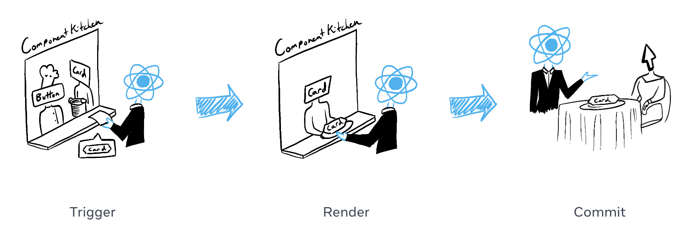

> <strong>- 주의 -</strong> <br /> 정리하면서 저의 생각도 많이 넣는 편입니다. <br /> 혹시나 제 글을 읽으실 때 아리송한 부분이 생기신다면 해당하는 공식 문서를 꼭 참고하시길 바랍니다. <br /> 또한, 저에게 익숙한 내용들은 생략하고 정리합니다.

화면은 사용자의 입력과 행동에 따라 업데이트 되곤 한다. carousel을 swipe를 하거나 버튼을 클릭하는 등의 행동 등을 통해서 말이다. React에서는 변경되는 데이터를 state라고 칭한다. 앞에서 말한 행동들은 결국엔 state를 변경시키고 변경된 state를 바탕으로 변경된 화면을 보여주게 된다. 이번 챕터에서는 컴포넌트가 어떻게 상호작용을 다룰 수 있는지, state를 업데이트 할 수 있는지, 어떻게 다른 화면을 보여주게 되는지 알 수 있게 될 것이다.

## Responding to events

React에서는 JSX문에 이벤트 핸들러를 부착할 수 있다. 이 때 이벤트 핸들러란 사용자의 상호작용, 이를테면 클릭이나 호버, 포커싱에 응답하여 트리거 되는 함수이다.

## State: a component’s memory

컴포넌트는 현재 input 태그에 입력된 값이라던가 현재 이미지, 현재 장바구니 등 어떤 것을 기억하고 있어야 할 때가 있다. React에서는 이러한 컴포넌트의 특별한 메모리를 state라고 부른다.

이 state는 `useState` 라는 React의 Hook을 이용해 컴포넌트에 넣어줄 수 있다. `useState` 는 다음과 같이 사용할 수 있고, 현재 state 값과 이 state를 변경시키기 위한 setter를 배열로 감싸서 반환한다.

```tsx
const [index, setIndex] = useState(0);
```

## Render and Commit

화면에 컴포넌트가 보여지기 위해서는 React에 의해 먼저 render되어야 한다. → 나는 여기서 이 render를 함수 호출로 이해하고 있다. 이 챕터에서 배우는 단계들은 React에 작성한 우리의 코드가 어떻게 실행되는지, 그리고 동작을 이해하는 데에 많은 도움이 될 것이다.

재료들을 바탕으로 맛있는 음식을 만드는 부엌의 요리사를 우리의 React 컴포넌트라고 상상해보자. 이 상황에서 React는 손님의 주문을 받고 이를 가져오는 웨이터라고 보면 된다. 이렇게 요청을 받고 UI를 서빙하는 것은 다음 3 단계를 거친다.

### 1. Triggering a render

웨이터가 주문을 요리사에게 전달한다. User Interaction → React → React Component

### 2. Rendering the component

요리사가 부엌에서 주문을 바탕으로 요리를 만든다. React Component makes JSX(React Component는 결국 JSX를 만드는 것이니, 나는 요리를 JSX문이라고 생각했다.)

### 3. Commiting to the DOM

손님에게 요리를 전달한다. React Component → React → User



## State as a snapshot

놀라울 수도 있지만, 보통의 자바스크립트의 변수와는 달리 React의 state는 snapshot처럼 동작한다. 기존 변수의 값을 변경시키는 것이 아니라 재렌더링을 트리거한다.

```tsx
console.log(count); // 0
setCount(count + 1); // Request a re-render with 1, 이게 React에서 state를 변경시키는 동작이다.
console.log(count); // Still 0!
```

스냅샷에 대해서는 추후에 더 자세히 알아보자.

## Queueing a series of state updates

```tsx
import { useState } from 'react';

export default function Counter() {
  const [score, setScore] = useState(0);

  function increment() {
    setScore(score + 1);
  }

  return (
    <>
      <button onClick={() => increment()}>+1</button>
      <button
        onClick={() => {
          increment();
          increment();
          increment();
        }}>
        +3
      </button>
      <h1>Score: {score}</h1>
    </>
  );
}
```

+3 버튼을 클릭 시 score가 3이 될 것 같지만 실제론 그렇지 않다. score는 1이 된다. state를 바꾸는 것은 새로운 render를 발생시키지만 이전의 코드를 바꾸진 않는다. 위의 경우 score는 계속해서 0이기 때문에 결국 마지막 increment가 발생해도 score는 0 + 1이기 때문에 최종적으로 1이 되는 것이다. 원하는대로 3이 나오게 하려면 `setScore(s => s + 1)` 로 작성하면 되는데, 이에 대해서는 추후 자세히 알아보자.

## Updating objects in state

React의 state는 값으로 object 형태 또한 취할 수 있다. 하지만 이 경우 object를 직접 변경하면 안되고 새로 생성하거나 복사해서 setter에 전달해야 한다. 이를 위한 간편한 방법으로 `...` 이라는 spread 연산자를 사용하면 된다. 혹은 객체가 계속해서 객체나 배열로 중첩될 경우, 완벽한 복사를 위해 spread 연산자를 계속 쓰곤 하는데 이를 줄이기 위해 [immer](https://github.com/immerjs/use-immer)라는 라이브러리를 사용할 수도 있다.

## Updating arrays in state

array 또한 state로 취할 수 있고, 직접 변경하면 안되고 새로 생성하거나 복사해 setter에 전달해야 한다. 똑같이 간편한 방법으로는 spread 연산자를 사용할 수 있다. 중첩되는 array에 spread 연산자를 계속 남발하는 것이 불편하다면 object의 경우와 동일하게 [immer](https://github.com/immerjs/use-immer)라는 라이브러리를 사용할 수도 있다.

## 참고

[Adding Interactivity](https://react.dev/learn/adding-interactivity)
