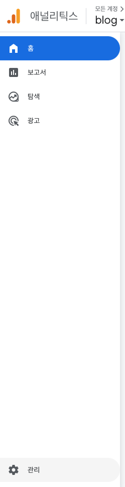

내 블로그에 방문한 사람들은 어떤 글을 가장 많이 볼까? 어떤 페이지를 가장 많이 볼까?라는 궁금증에 Google Analytics를 얼마 전에 설정했다. 이번 글에서는 GatsbyJS로 만든 프로젝트에 어떻게 Google Analytics를 설정했는지 말하고자 한다. 정말 쉽다!

## How?

### Google Analytics 계정 만들기

먼저 [google analytics](https://analytics.google.com/)를 검색하고 로그인해주자.

그러고 나면 옆의 사이드바에서 `관리`를 클릭하자.



<br />
<br />
<br />

그러면 다음과 같은 화면이 나온다. 여기서 계정 만들기를 클릭해주자.


<br />
<br />
<br />

여기서부터는 각자의 상황에 맞게 하면 되겠다. 먼저 계정을 설정하고,


<br />
<br />
<br />

속성을 설정한 다음,


<br />
<br />
<br />

비즈니스 정보를 입력하고 만들기를 클릭하면 된다. 이후 약관 동의가 뜨는데 대한민국으로 바꾸고 모두 동의해주었다.


<br />
<br />
<br />

이후 데이터 스트림에서 웹을 클릭하자.


<br />
<br />
<br />

google analytics를 부여할 url을 넣고 스트림 이름을 설정한 다음 스트림 만들기를 클릭하면


<br />
<br />
<br />

측정 ID가 생긴다. 이 ID를 복사해두자.


<br />
<br />
<br />

이제 google analytics 사이트에서 설정해둬야 할 것들은 끝났다.

<br />
<br />
<br />

### Gatsby 프로젝트에 Google Analytics 설정하기

Gatsby 프로젝트로 돌아와서 터미널에 다음을 입력하여 Google Analytics 플러그인을 설치해주자.

`npm install gatsby-plugin-google-gtag`

<br />

그리고 `gatsby-config.js` 파일로 이동해 `plugins`에 다음과 같이 추가해주자.

```javascript
module.exports = {
  ...

  plugins: [
    ...

    {
      resolve: 'gatsby-plugin-google-gtag',
      options: {
        trackingIds: ['G-XXXXXXXXXX'],
      },
    },

    ...
  ],
};
```

gtag를 이용한 특정 이벤트 측정이라던가 더 자세한 설정은 [공식 문서](https://www.gatsbyjs.com/plugins/gatsby-plugin-google-gtag/)를 통해 확인하면 될 것 같다.

여담으로 React에서나 Next 프로젝트에서는 페이지가 변경될 때 마다 gtag를 이용해 google analytics로 데이터를 보내는 코드를 추가로 작성해야 했는데 Gatsby에서는 위와 같이 플러그인을 설치하고 `gatsby-config.js`에 설정만 해주면 된다.

물론 다음과 같이 각 페이지들마다 title 태그를 꼭 명시해줘야 제대로 데이터를 측정할 수 있다. 안 그러면 Not set이라는 이름으로 측정되어 어떤 페이지를 방문한 건지 알 수 없게 된다.

`404.tsx`

```tsx
...

import { Helmet } from 'react-helmet';

const NotFound = () => {
  return (
    <>
      <Helmet>
        <title>Not Found</title>
      </Helmet>
      <Container>
        <h1>Not Found. 404 Error.</h1>
        <GoHomeButton to={ROUTES.HOME}>Home</GoHomeButton>
      </Container>
    </>
  );
};

export default NotFound;

...
```

Next에서는 Head 컴포넌트를 이용해 html의 head 태그 안에 들어가는 태그들, 이를테면 meta나 title 태그를 설정해줄 수 있었다. 나는 Gatsby에서 react-helmet을 사용했다. 이를 사용하는 방법 역시 단순하다. 다음과 같이 플러그인과 라이브러리를 설치해주자.

`npm install gatsby-plugin-react-helmet react-helmet`

TypeScript를 사용하고 있다면 다음 패키지도 설치해주자.

`npm install --save-dev @types/react-helmet`

설치를 마치고 나면 `gatsby-config.js`의 plugins에 다음과 같이 등록해주면 된다.

```javascript
module.exports = {
  ...

  plugins: [
    ...

    'gatsby-plugin-react-helmet',

    ,,,
  ],
};
```

그리고 나면 위에 적은 404 페이지 코드처럼 사용할 수 있다.

<br />
<br />
<br />

### 데이터 통계

24 ~ 48 시간이 지나면 Google Analytics가 다음과 같이 보고서를 만들어준다. 그 이전에는 보고서 - 실시간 항목을 이용해 실시간으로 몇 명의 사용자가 어떤 페이지를 보고 있는지 확인할 수 있다.


<br />
<br />
<br />

## 사람들은 내 블로그에서 어떤 글들을 제일 많이 봤을까?

비록 글도 적고 총 조회수도 적지만 대체로 Home 페이지에서 Featured 화면의 조회수가 높은 것을 확인할 수 있었다. Featured라는 공간을 따로 두어, 사람들이 조금 더 봐주었으면 하는 글들을 잘 노출될 수 있도록 마련해두었는데 의도가 잘 먹힌 것 같다.

<br />
<br />
<br />

## 참고

[gatsby-plugin-google-gtag](https://www.gatsbyjs.com/plugins/gatsby-plugin-google-gtag/)
