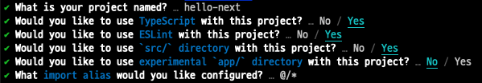
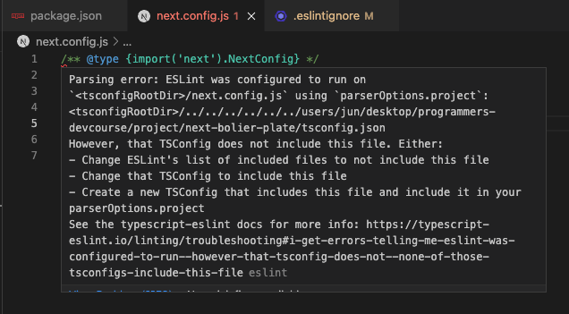
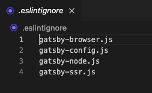

약 6개월 전, React를 얕게 맛 보고 'state는 계속해서 값이 바뀔 수 있으니까 let으로 써야겠다. ㅎㅎㅎ'와 같은 생각으로 다음과 같이 useState를 썼던 기억이 난다.

```javascript
let [a, setA] = useState('');
let temp = true;
```

실제로 변수명도 저 따위로 작명했었다. 아마 지금 내가 저렇게 작성한 사람의 코드를 보면 의문이 생길 것이다. 'let으로 작성한 이유가 무엇인가요..? temp는 사용하지 않는 변수같은데 왜 그대로 두셨나요..?'

팀을 이루어 프로젝트를 진행할 때 코딩 스타일을 어느 정도 맞추고 가지 않으면 저런 논쟁이 발생할 수 있고, 이는 개발 생산성을 떨어뜨릴 것이다. 최대한 ESLint나 Prettier에 맡겨서 무의미한 시간 낭비를 줄여보자.

<br />
<br />
<br />

# Next, TypeScript 프로젝트 생성

최근 Next, TypeScript 환경에서 프로젝트를 진행하게 되어, 해당 환경에서 eslint, stylelint, prettier, husky, lint-staged를 설정하게 되었다.

```
npx create-next-app@latest -ts
```



<br />
<br />
<br />

# ESLint

위와 같이 입력 후 프로젝트를 만들고 나면 .eslint.json 파일이 존재한다. 다음 명령어를 입력해 필요한 패키지를 설치하자.

```
npm install --save-dev @typescript-eslint/eslint-plugin @typescript-eslint/parser eslint-plugin-simple-import-sort
```

간략하게 해당 패키지들이 어떤 패키지인지 알아보자.

- @typescript-eslint/eslint-plugin: typescript 코드에 lint 규칙들을 제공하는 플러그인
- @typescript-eslint/parser: eslint가 typescript 코드를 lint 할 수 있도록 typescript estree를 활용하는 eslint parser(미안합니다. 자세한 건 아직 저도 잘 모릅니다. 그냥 그렇답니다.)
- eslint-plugin-simple-import-sort: 자동으로 import 구문들을 정렬할 수 있게 도와주는 플러그인

이후 .eslintrc.json 파일은 다음과 같이 작성한다.

```json
{
  "settings": {
    "react": {
      "version": "detect"
    }
  },
  "extends": [
    "next/core-web-vitals",
    "eslint:recommended",
    "plugin:react/recommended",
    "plugin:@typescript-eslint/recommended",
    "plugin:@typescript-eslint/recommended-requiring-type-checking",
    "prettier"
  ],
  "parser": "@typescript-eslint/parser",
  "parserOptions": {
    "ecmaFeatures": {
      "jsx": true
    },
    "ecmaVersion": 12,
    "sourceType": "module",
    "project": "./tsconfig.json"
  },
  "plugins": ["react", "@typescript-eslint", "prettier", "simple-import-sort"],
  "rules": {
    "react/react-in-jsx-scope": "off", // import React from 'react' 안해도 되게 만들어줌.
    "simple-import-sort/imports": "error", // import 구문 순서 엉망이면 에러 냄.
    "simple-import-sort/exports": "error", // export 구문도 순서 엉망이면 에러 냄.
    "@typescript-eslint/no-unused-vars": "error", // 안 쓰는 변수 그대로 두면 에러 냄.
    "@typescript-eslint/no-explicit-any": "error" // any 쓰면 에러 냄.
  }
}
```

import 구문 순서 엉망인 게 보기 싫었는데 하나하나 다 정해주는 건 귀찮아서 가져다 썼다. 그리고 any 남발하면 나를 혼내주기 위해 `"@typescript-eslint/no-explicit-any": "error"`도 추가했다.

그리고 위와 같이 작성하면 이상하게 next.config.js에서 에러가 발생하더라.



검색해도 해결하는 데에 오래 걸릴 것 같아서 .eslintignore 파일을 루트 디렉토리에 생성하여 다음과 같이 작성해주었다.(그냥 .eslintignore라고 확장자 없이 작명해도 됩니다.)

```
next.config.js
```

gatsby에서는 위와 같은 js 파일들은 eslintignore 파일에 작성해두기도 한다. 실제로 gatsby를 typescript 프로젝트로 생성 후 .eslintignore 파일을 확인하면 다음과 같이 작성되어 있다.



그래서 괜찮겠지~ 하고 일단 넘어갔다. ^^ (후에 이로 인해 문제가 생기면 해당 포스트도 고칠 예정입니다)

# Prettier

다음 패키지들을 설치해주자.

```
npm install --save-dev eslint-config-prettier eslint-plugin-prettier prettier
```

eslint는 린팅 뿐만 아니라 포맷팅도 제공해준다. 근데 prettier에 비해 포맷팅 능력은 모자르다. 그래서 포맷팅은 prettier한테 맡기고 충돌을 피하기 위해 eslint-config-prettier, eslint-plugin-prettier가 필요하다.

.prettierrc 파일을 만들고 다음과 같이 작성해주자.

```json
{
  "jsxSingleQuote": true,
  "bracketSameLine": true,
  "singleQuote": true,
  "printWidth": 90,
  "tabWidth": 2,
  "useTabs": false,
  "semi": true,
  "quoteProps": "as-needed",
  "trailingComma": "es5",
  "arrowParens": "always",
  "endOfLine": "lf",
  "bracketSpacing": true,
  "requirePragma": false,
  "insertPragma": false,
  "proseWrap": "preserve"
}
```

jsx문에서도 작은 따옴표를 쓰도록, 그리고 bracket이 혼자 뚝 떨어져서 jsx문이 더러워지는 것을 방지했다.
자세한 속성은 [이 링크](https://prettier.io/docs/en/options.html)에서 확인할 수 있다. 그리고 기본 값과 같은 것들은 사실 따로 작성해주지 않아도 알아서 기본값으로 작동한다.
예를 들면 semi 속성의 기본값은 true이다. 따라서 `"semi": true`를 지워도 .prettierrc 파일이 있는 이상 vscode 설정을 따라가지 않고 .prettierrc에 정해진 속성들을 따라가는데 semi는 기본값이 true이기에 알아서 세미 콜론을 붙인다.

<br />
<br />
<br />

# Stylelint

난 최근까지 css 코드도 lint 해줄 수 있다는 것을 몰랐다. 최근에 데브코스에서 갓종현 1기 선배님과 동기인 다연이한테 가르침을 받고 알 수 있게 되었다.

emotion을 쓰는데 css prop 방식이 styled 방식을 사용할 것이다. 그럴 거면 다음 과정을 따르면 된다.

먼저 관련 패키지를 설치한다.

```
npm install --save-dev @stylelint/postcss-css-in-js stylelint postcss postcss-syntax stylelint-config-prettier stylelint-config-rational-order stylelint-config-recommended stylelint-config-styled-components
```

아따 엄청 많다. styled 방식을 사용하다보니 몇 가지 패키지가 더 추가되었다.

다음은 .stylelintrc 파일을 생성하고 다음 코드를 작성한다.

```json
{
  "extends": [
    "stylelint-config-recommended",
    "stylelint-config-styled-components",
    "stylelint-config-prettier",
    "stylelint-config-rational-order" // css 코드 순서를 정렬해준다.
  ],
  "overrides": [
    {
      "files": ["**/*.tsx"],
      "customSyntax": "@stylelint/postcss-css-in-js"
    }
  ],
  "rules": {
    "function-no-unknown": [true, { "ignoreFunctions": ["/\\${/"] }]
  }
}
```

stylelint-config-rational-order가 꿀이다. css 코드 순서를 정렬해준다. 예로 display 속성의 경우 css 코드에서 맨 위로 올려준다.

그리고 루트 디렉토리에 .vscode 폴더를 만들고 그 안에 settings.json 파일을 만든다. 그 다음에 다음 코드를 작성해준다.

```
{
  "stylelint.enable": true,
  "stylelint.validate": ["css", "scss", "typescript", "typescriptreact"]
}
```

요걸 해줘야 vscode가 인식을 하는지, 자동 저장 시에 styled 안의 코드들을 정렬해준다.

<br />
<br />
<br />

# nvmrc

.nvmrc 파일을 만들어 다음과 같이 작성해주면 node 버전을 일치시킬 수 있다. 레포를 git clone 한 후 `nvm use` 를 실행해주면 해당 .nvmrc에 적힌 버전으로 바뀐다. 없으면 해당 버전을 설치해주고 `nvm use`를 해주면 된다.

```
v18.13.0
```

<br />
<br />
<br />

# Husky + Lint-Staged

husky를 통해 보통 commit이나 push를 하기 전에 앞서 설정한 eslint, prettier 규칙들이 제대로 적용되었는지 검사하고 고쳐줄 수 있다. 또한 lint-staged를 통해 git add 후 staged된 파일들도 eslint, prettier 규칙들을 검사하고 고쳐줄 수 있다.
특히 eslint 규칙을 지키지 않은 체로 commit 혹은 push를 할 경우 error을 내어 commit이나 push를 막을 수 있게 된다.

다음 패키지들을 설치하자.

```
npm install --save-dev husky lint-staged
```

그리고 다음 명령어를 입력해주자.

```
npx husky install
npx husky add .husky/pre-commit "npx lint-staged"
```

이렇게 하면 해당 폴더에 husky가 설치되면서 .husky라는 폴더가 생긴다. 그리고 2번째 명령어를 통해 commit 이전에 npx lint-staged를 통해 staged된 파일들에 대해 lint-staged가 작동하도록 해주었다.

그렇다면 이제 lint-staged가 어떤 동작을 하면 될지 설정해주자. .lintstagedrc.js 파일을 만들어 다음 코드를 작성해주자.

```javascript
module.exports = {
  // Type check TypeScript files
  '**/*.(ts|tsx)': () => 'npx tsc --noEmit',

  // Lint & Prettify TS and JS files
  '**/*.(ts|tsx)': filenames => {
    return [
      `npx eslint --fix ${filenames.join(' ')}`,
      `npx prettier --write ${filenames.join(' ')}`,
      `npx stylelint --ignore-path .gitignore ${filenames.join(' ')}`,
    ];
  },
};
```

타입스크립트 파일들에 대해 타입 체킹만 하고 output은 하지 않는다.(--noEmit) 그리고 각 타입스크립트 파일들에 대해 eslint, prettier, stylelint를 적용시켰다. 이 과정에서 앞서 정한 규칙들을 지키지 않은 코드들은 eslint나 prettier, stylelint가 고쳐줄 수 있는 데까지 고치고, 못 고치는 것에 대해서는 에러를 발생시켜 commit을 막는다. 다시 고쳐야만 통과할 수 있고 깃헙 레포에 push 할 수 있게 된다.

마지막으로 남은 과정은 git clone 후 자동으로 husky가 설치되도록 해주는 것이다. 다른 팀원이 레포를 clone해온 후 `npx husky install`과 `npx husky add .husky/pre-commit "npx lint-staged"`를 까먹으면 말짱도루묵이다. 따라서 git clone 후 npm install을 하면 알아서 husky가 설치되도록 해줘야 더욱 안전해진다. 이는 package.json의 scripts에서 postinstall 명령어를 통해 해결할 수 있다. npm install 이후 실행할 명령어를 적을 수 있게 해준다.

`package.json`

```
{
  "scripts": {
    ...
    "postinstall": "husky install",
    ...
  },
```

<br />
<br />
<br />

# 여담

여태까지 설치한 패키지들 모두 devDependency로 설치하였다. production에는 영향을 끼치지 않고 개발할 때만 영향을 끼치도록 한 것이다. 즉 내가 한 것들은 모두 개발을 더 편리하게 만들어준다.

# 참고

[소스 코드](https://github.com/metacode22/next-bolier-plate)

부디 잘못된 내용이 있으면 댓글이나 이메일로 저를 혼내주세요.😘 Gmail: alohajune22@gmail.com

https://www.npmjs.com/package/@typescript-eslint/parser

https://www.npmjs.com/package/@typescript-eslint/eslint-plugin

https://www.npmjs.com/package/eslint-plugin-simple-import-sort

https://github.com/lydell/eslint-plugin-simple-import-sort

https://prettier.io/docs/en/options.html
