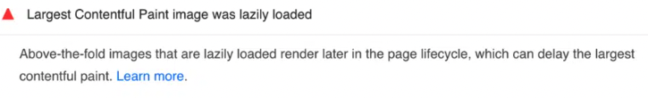

## LCP란?

Largest Contentful Paint의 약자로, 화면에서 가장 큰 컨텐츠 엘리먼트가 나타날 때 측정된다. 페이지의 주요 내용이 화면에 렌더링이 완료되는 시기를 결정하는 데에 사용된다.

## 문제

해당 블로그의 경우 Home 화면의 내 얼굴 사진이 화면에서 가장 큰 컨텐츠 엘리먼트로 잡히고 있었다. 여기서 실수한 점은 얼굴 사진 또한 포스트 아이템의 썸네일과 동일하게 lazy loading을 적용해놓았다는 점이다. 그로 인해 Lighthouse로 측정 시 Performance 항목에서 다음과 같이 `Largest Contentful Paint image was lazily loaded`라는 경고 문구가 떴다.



LCP 속도는 2.2s로 Need Improvement였다.(orange 라벨은 Need Improvement를 뜻한다) 그리고 Performance 점수 또한 93점으로 측정되었다.

검색을 통해 lazy-loading-best-practices라는 글을 web.dev 사이트에서 확인할 수 있었다. 여기서는 상단에 노출되는(above the fold) 이미지는 lazy loading을 하지 말 것을 추천하고 있다. 생각해보면 당연하다. 맨 상단에 나타남에도 불구하고 lazy loading을 적용하면 사용자에게 더 늦게 보여지게 된다. 물론 모바일 환경과 랩탑 환경의 상단 범위는 다르므로 적절히 적용할지 말지 결정하라고 권고하고 있다.

## 해결

단순하게 해당 태그의 loading 속성을 eager로 바꾸었다. 나 같은 경우 Gatsby의 Image 컴포넌트를 사용했다. 찾아보니 [Gatsby 공식 문서에서도 상단에 노출되는(above the fold) 이미지는 eager loading 사용을 권장](https://www.gatsbyjs.com/docs/reference/built-in-components/gatsby-plugin-image/#shared-props)하고 있다.

```tsx
const Introduction = ({ image }: Props) => {
  return (
    ...

        <IntroductionAvatar image={image} alt='내 얼굴' loading='eager' />

    ...

const IntroductionAvatar = styled(GatsbyImage)`
  width: 180px;
  height: 180px;
  border-radius: 50%;
`;
```

Lighthouse로 재측정하니 Performance 점수가 99에서 100으로 나타났다. 그리고 `Largest Contentful Paint image was lazily loaded` 경고 문구도 사라졌다.


