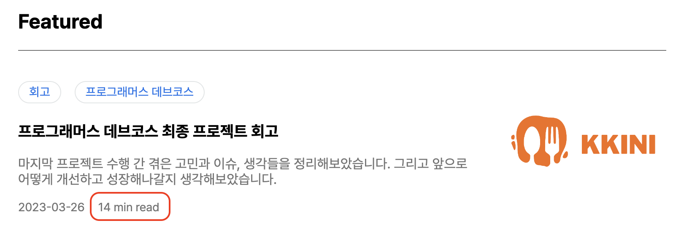
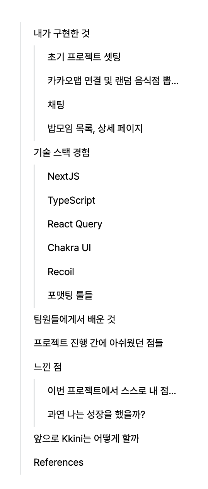
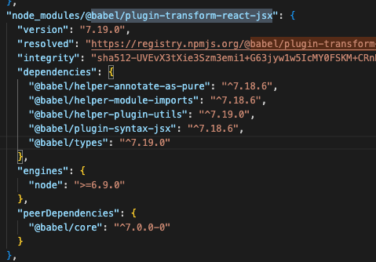
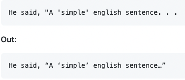
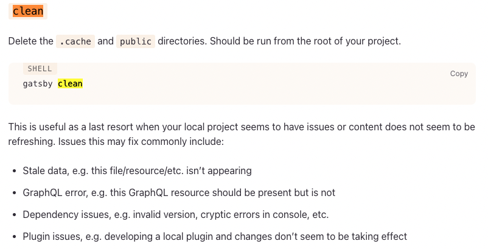
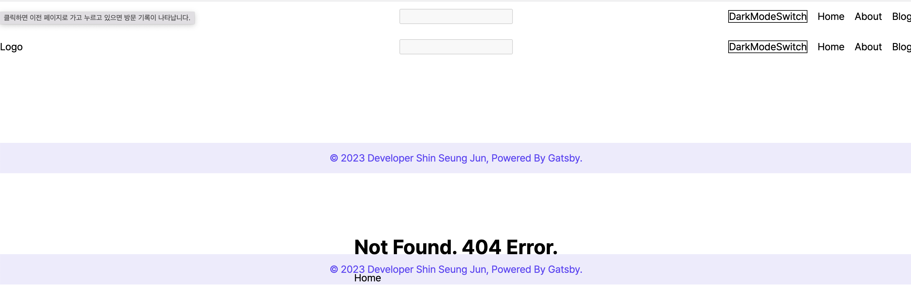
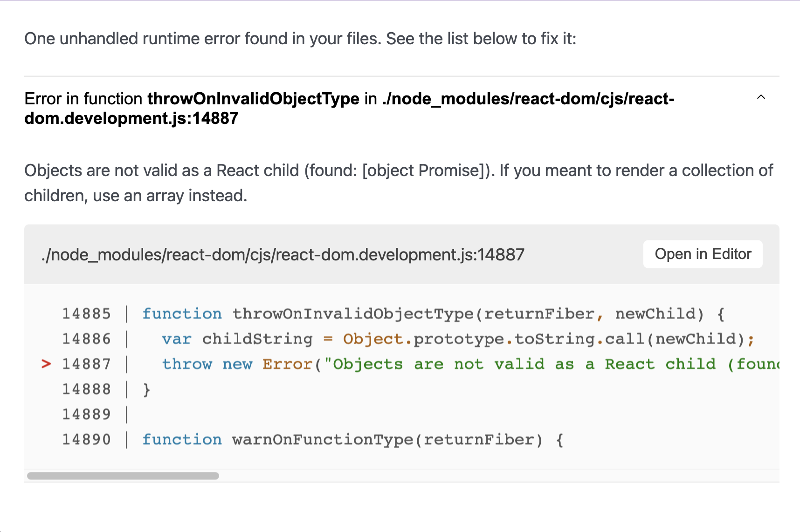
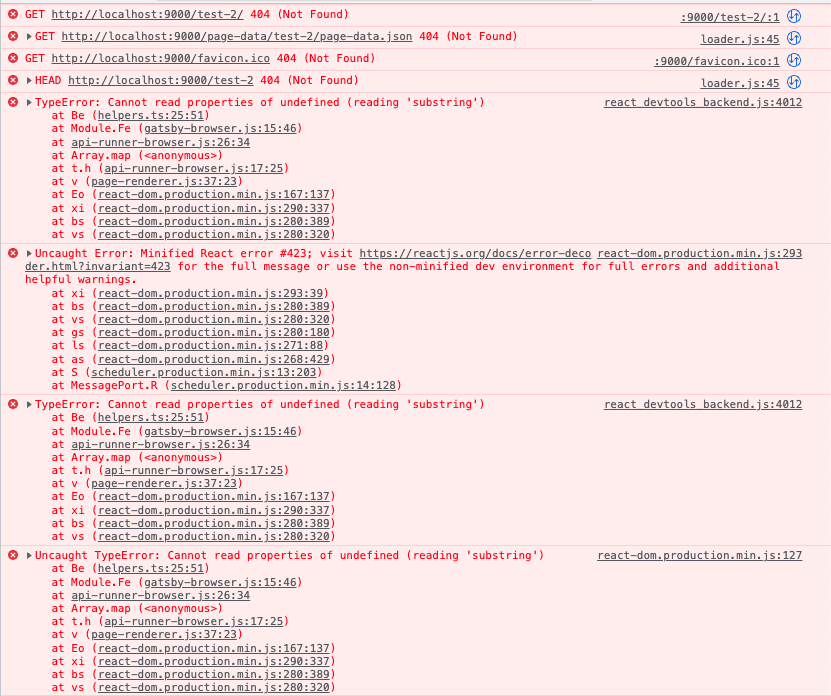

꾸준히 관리하는 블로그가 하나 쯤은 있었으면 좋겠다는 생각을 개발자가 되기를 마음 먹었던 순간부터 가지고 있었다. 찾아보니 Gatsby가 적절하다는 아티클들이 많았고, 마침 인프런에 텍스트로 제공되는 무료 강의가 있었다.

데브코스에 참여하고 있던 와중 2주 정도 여유로운 시간이 생겼었는데 때마침 나처럼 블로그를 만들고 싶어하던 동기가 있었다. 그래서 2주간 스터디를 진행하여 완벽하진 않지만 구실은 할 수 있는 블로그를 만들었다.(회사를 다니며 데브코스를 병행하던 동기였는데 그 와중에 블로그도 만들고 정말 대단한 친구다)

<br />

## Gatsby를 선택한 이유

이미 잘 만들어진 블로그 플랫폼들은 많다. Velog, Tistory, Medium, Naver 등... 하지만 꼭 나만의 블로그를 만들어보고 싶었다. 이전에는 Velog와 Tistory를 사용했었는데 꼴에 개발자라고 맘에 안드는 부분들이 조금씩 존재했다. 디자인을 마음대로 바꿀 수 없다는 것도 단점으로 다가왔다. 그리고 무엇보다 블로그를 직접 만들어보면서 배울 수 있는 것들이 많을 것이라 생각했다.

그래서 구글링을 통해 얻은 기술 선택지는 2가지였다. NextJS와 GatsbyJS이다. 전자의 경우, 데브코스 마지막 프로젝트에 앞서 많은 공부가 될 것 같았다. Next로 블로그를 만든 레퍼런스도 어느 정도 존재했고 아주 조금 유데미 강의를 통해 공부를 해봤어서 나름 수월하게 만들 수 있을 것 같았다. 후자의 경우는 거의 모르는 기술이고 블로그를 제외하곤 Next보다 레퍼런스도 적을 것이라 판단했다. 그럼에도 불구하고 Gatsby를 선택했다. 이유는 간단했는데, 이전에[ Gatsby를 통해 블로그를 만드신 멘토님](https://shylog.com/which-is-better-nextjs-or-gatsbyjs/)이 추천해주셨기 때문이다.

블로그 구실은 할 수 있게 만든 지금 시점에서 NextJS와 비교했을 때 GatsbyJS의 장점은 다음과 같다고 생각한다.

- 블로그 개발을 위한 많은 플러그인들을 제공: GatsbyJS를 사용하면서 가장 많은 만족감을 느낀 부분이다. 이런 것도 플러그인으로 있을까..?라고 생각하면서 검색해보면 그 플러그인이 존재했다. 그냥 그걸 가져다 쓰기만 하면 되었다. 물론 가져다 쓰는 것이 쉬운 것은 아니었다. ㅎㅎㅎ! 이런 것도 있어?라고 개인적으로 느꼈던 플러그인들이 있는데, 바로 Time to Read, Table of Contents였다. 해당 글을 읽는 데에 얼마나 걸리는지, 그리고 목차이다. 각각 `gatsby-remark-reading-time`, `gatsby-remark-table-of-contents`이라는 이름으로 존재한다. 근데 나중에 확인해보니 버전이 올라가면서 바뀐 것인지 해당 플러그인을 쓰지 않아도 graphQL 데이터층에서 이미 제공하고 있었다.
- Image 최적화: SSG로 배포할 때 NextJS와 가장 큰 차이점을 보이는 부분이지 않나 싶다. Next/Image를 제대로 사용하려면 서버가 필요하다. 따라서 보통 Vercel을 사용한다. 그렇다면 Vercel을 사용해서 배포하면 되지 않느냐? 맞다. 그러면 된다. 하지만 나는 Github-Pages로 배포하고 싶었다. 그럴 경우 Next/Image를 제대로 사용할 수 없다. Github-Pages는 따로 서버를 제공하지 않기 때문이다. 그럼에도 불구하고 Github-Pages를 선택한 이유는 다음과 같다.
  - [한국의 경우 Vercel보다 조금 더 빠르다.](https://bejamas.io/compare/github-pages-vs-vercel/)
  - Github Pages는 완전 무료이다. 반면 무료로 Vercel을 사용할 경우 제한이 있다. [Image 최적화는 1000개까지만 해주며, 배포는 매일 100번](https://vercel.com/pricing)만 가능하다. 후자의 경우는 거의 걸릴 일이 없다고 쳐도 전자의 경우는 나중에 블로그가 커질 수록 슬슬 쫄릴 수 있다고 생각했다.
  - 인프런 강의가 Github Pages로 배포했다. 강의대로 따라가는 게 이슈를 줄일 수 있을 거라 생각했다. Vercel로 배포하는 것이 어려운 건 아니지만 사소한 부분에서 스트레스를 받긴 싫었다.
    어쨋든 Gatsby/Image의 경우는 SSG, 즉 빌드 시점에서 최적화가 이루어지기 때문에 따로 서버가 필요없다. 따라서 Github Pages를 통해 배포해도 Gatsby/Image에 영향을 끼치지 않는다.
- 공식 문서: 앞서 말한 것처럼 블로그를 만들 때 필요한 것들 대부분은 공식 문서에 있다. 영어이기 때문에 이해가 잘 안되는 부분 혹은 조금 더 커스텀하고 싶은 부분들은 따로 검색해서 찾아보았다. 하지만 대부분 강의와 공식 문서만으로 구현할 수 있었다. 처음엔 조금 이해하기 힘들 수 있는데 익숙해진다면 이만한 공식 문서가 없다는 생각이 들만큼 잘 되어 있지 않나 싶다. 물론 Next도 잘 되어 있지만 블로그 개발에 있어서는 Gatsby가 더 잘 되어 있다는 느낌을 받았다. 여태 본 공식 문서들 중 Vue 다음으로 잘 되어 있지 않나 싶다.

<br />

## 개발 과정

블로그를 만드는 자세한 과정들은 인프런 강의나 많은 아티클들에서 자세하고 이해하기 쉽게 잘 작성되어 있다. 그래서 여기엔 대략적으로 흐름 정도만 작성하려고 한다.

### SSG + 마크다운 파일 렌더링

SSG, static site generation은 말 그대로 정적 페이지 생성이다. 미리 데이터가 다 들어간 HTML을 만들어서 서버가 가지고 있다가 사용자가 그 페이지에 방문하여 요청하면, 그 때 부랴부랴 만드는 것이 아니라 미리 만들어진 페이지를 곧바로 보여주는 것이다. 따라서 빌드 시점에는 어느 정도 시간이 걸리겠지만(엄청 오래 걸리는 것도 아니다. 몇 분 정도?) 사용자가 방문할 때는 그 때 부랴부랴 브라우저에서 페이지를 렌더링하는 CSR과는 다르게 서버에서 가지고 있는 걸 사용자가 다운만 받으면 되므로 더 빠르게 보여줄 수 있다. 즉 사용자 경험이 더 좋아지는 것이다. 따라서 검색 엔진도 데이터가 가득 찬 화면을 볼 수 있기에 SEO에도 좋다.

Gatsby를 통해 마크다운을 렌더링하는 형식이 SSG로 이뤄진다는 말이었다. 그렇다면 어떻게 마크다운 파일을 렌더링할 수 있을까? Gatsby에서는 `gatsby-source-filesystem`이라는 플러그인을 사용해 마크다운 파일을 데이터로 뽑아내어 graphQL 데이터층에 주입한다. 다음과 같이 `gatsby-config.js`에 선언해주면, 해당 경로 안의 파일들을 파일 노드로 변환하여 graphQL 데이터층에 넣는다.(사실 graphQL 데이터층이라고 표현하는 것이 맞는지는 모르겠다)

```javascript
module.exports = {
  ...

  plugins: [
    ...

    {
      resolve: 'gatsby-source-filesystem',
      options: {
        name: 'contents',
        path: `${__dirname}/contents`,
      },
    },

    ...
  ],
};

```

그리고 각 마크다운 파일마다 상단에 다음과 같은 형식으로 데이터를 작성하는데, 이는 `gatsby-transformer-remark`에 의해 파싱되고 이 또한 graphQL 데이터로 들어간다.

```
---
date: '2023-03-30'
title: 'Gatsby와 함께 나만의 블로그 만들기'
summary: 'Gatsby와 함께 나만의 블로그 만들기'
thumbnail: './gatsby_logo.png'
categories: ['Featured', 'GatsbyJS', '회고']
---
```

블로그들의 카테고리나 제목, 날짜들은 내가 이용해야 하는 데이터들이다. 내 블로그의 Posts 페이지에 나오는 카테고리 등처럼 따로 다른 로직으로 사용하기 위해서는 데이터로 뽑아내야 한다. 매번 내가 수동으로 작성하는 것은 비효율적이기에 이렇게 중요한 데이터들은 따로 뽑아낼 수 있도록 한다. 위와 같은 데이터들을 보통 frontmatter라고 부른다.

이렇게 `gatsby-source-filesystem`을 통해 마크다운 파일을 뽑아내고, `gatsby-transformer-remark`를 통해 마크다운 파일의 중요한 데이터들도 뽑아냈다. 그렇다면 어떻게 graphQL에서 데이터를 뽑아와 렌더링할까? 핵심적으로는 다음 컴포넌트를 통해 마크다운을 렌더링하게 된다. 현재 보고 있는 화면도 마찬가지이다.

`PostTemplate.tsx`

```tsx
...

const PostTemplate = ({
  data: {
    allMarkdownRemark: { edges },
  },
  location: { href },
}: Props) => {
  const contentRef = useRef<HTMLDivElement>(null);
  const {
    node: {
      tableOfContents,
      timeToRead,
      html,
      frontmatter: {
        title,
        summary,
        date,
        categories,
        thumbnail: {
          childImageSharp: { gatsbyImageData },
          publicURL,
        },
      },
    },
  } = edges[0];

  return (
    <Layout title={title} description={summary} url={href} image={publicURL}>
      <Container>
        <PostHead
          title={title}
          date={date}
          categories={categories}
          thumbnail={gatsbyImageData}
          timeToRead={timeToRead}
        />
        <PostContent ref={contentRef} html={html} />
        <PostComment />
        <TableOfContents ref={contentRef} tableOfContents={tableOfContents} />
      </Container>
    </Layout>
  );
};

export default PostTemplate;

export const getMarkdownDataBySlug = graphql`
  query getMarkdownDataBySlug($slug: String) {
    allMarkdownRemark(filter: { fields: { slug: { eq: $slug } } }) {
      edges {
        node {
          tableOfContents
          timeToRead
          html
          frontmatter {
            title
            summary
            date(formatString: "YYYY-MM-DD")
            categories
            thumbnail {
              childImageSharp {
                gatsbyImageData
              }
              publicURL
            }
          }
        }
      }
    }
  }
`;

...
```

매 포스트 페이지마다 slug가 존재한다. 이 slug를 통해 graphQL로 slug에 맞는 마크다운 데이터를 가지고 온다. 마치 Next의 getStaticProps 혹은 getServerSideProps처럼 graphql을 통해 미리 데이터를 가지고 와서 이 데이터를 컴포넌트 함수의 props로 전달한다. 이렇게 해서 마크다운 파일 데이터를 PostTemplate라는 컴포넌트 함수에서 사용할 수 있게 된다. categories를 통해 카테고리를 보여주면 되고 timeToRead를 통해 읽는 데에 얼마나 걸리는지, tableOfContents를 통해 목차를 렌더링하고 있다. 그리고 html을 PostContent라는 컴포넌트에 전달하고 있는데 내부적으로 dangerouslySetInnerHTML을 통해 html을 렌더링한다.

잘 설명이 되었을지 모르겠다. 인프런 강의도 보고 공식 문서도 여러 번 보았지만 아직도 헷갈리는 부분이다.

### Time to Read

Medium 블로그를 보면서 꼭 넣고 싶었던 기능이다. Gatsby에 관련 플러그인이 존재하는데 처음엔 몰랐어서 어떻게 직접 구현하지?라고 생각하면서 고민하던게 생각난다. 결론은 `gatsby-remark-reading-time`이라는 플러그인을 사용하면 되는 거였다. 근데 이것도 나중에 혹시나 싶어서 제외하고 해보니까 잘 작동했다. 버전이 올라가면서 기본으로 탑재된 건 아닐까라고 생각해봤다.

근데 이걸 10분 만에 다 읽을 수 있나? 싶을 정도로 빠듯하게 측정되는 것 같긴 하다...



### Table of Contents

이건 가장 넣고 싶었던 기능이다. 간지나지 않는가? ㅎㅎㅎ. 없을 땐 휑했는데 만들고 나니 화면도 어느정도 꽉 차보이고, 목차만 보고 대강 내용을 유추해 원하는 부분으로 바로 이동시킬 수 있으니 사용자 경험도 더 좋아지지 않을까 싶다.

이것도 Gatsby에서는 플러그인으로 제공하고 있다. 바로 `gatsby-remark-table-of-contents`인데 이것도 실험해보니까 굳이 추가 안해도 잘 작동하더라!



뷰의 크기가 작아지면 화면에서 안 보이도록 반응형으로 구현해두었다. 작은 화면에서도 목차가 있으면 오히려 본 내용을 읽는 데에 방해될 것 같아서이다. 따라서 태블릿이나 모바일에서는 보이지 않을 것이다.

### 댓글

댓글은 utterances를 통해 쉽게 구현하였다. utterances는 Github Issues를 기반으로 댓글 기능을 사용할 수 있게 해준다. 즉 Github Repository가 필요하다.

여담으로 좋았던 것은 댓글이 등록되었는지 확인하려면 블로그를 방문하거나 Github Issues를 매번 확인해야 될 줄 알았는데 gmail로도 날라와서 실시간으로 누가 어떻게 댓글을 달았는지 확인할 수 있어서 좋았다.

### 기타

#### Gatsby Link

다른 페이지로 이동시키기 위해 Gatsby Link를 사용했다. Next와 거의 동일한 것 같다. 마우스만 올려도 preloading이 된다. 실제로 마우스를 올리면 개발자 도구의 네트워크 탭에서 request가 증가하는 것을 볼 수 있고 필요한 데이터를 다운 받는 것을 확인할 수 있다. [내부적으로는 Intersection Observer API를 사용](https://www.gatsbyjs.com/docs/reference/built-in-components/gatsby-link/#link-drives-gatsbys-fast-page-navigation)한다고 공식 문서에 나와 있다. 어쨋든 preloading을 통해 데이터를 미리 받아오니 빠르게 사용자에게 다음 화면을 보여줄 수 있다.

#### babel로 react is not defined 에러 없애기

Gatsby의 경우, `import React from 'react'`를 해주지 않으면 `react is not defined` 에러가 발생한다. 강의에서는 매번 import 구문을 컴포넌트 파일마다 작성해주고 있는데, 사소하지만 비효율적이라고 판단했다. 그래서 찾아보니 `gatsby-node.js` 파일에서 다음과 같이 babel을 설정해주면 import 구문을 매번 작성해주지 않아도 된다.

```javascript
exports.onCreateBabelConfig = ({ actions }) => {
  actions.setBabelPlugin({
    name: '@babel/plugin-transform-react-jsx',
    options: {
      runtime: 'automatic',
    },
  });
};
```

`package-lock.json`을 확인해보니 이미 디펜던시로 존재하는 것 같아 따로 설치하진 않았다. 그래도 잘 먹히더라!



#### Scroll to Top

인프런 강의에 없는 것인데 그냥 있으면 좋을 것 같아 구현했다. 코드는 다음과 같다. 조금 특별한 점은 addEventListener에서 options 객체에 passive 속성을 true로 해준 것이다. addEventListener에 등록된 이벤트는 컴포지터 쓰레드에 의해 처리되는데 이 컴포지터 쓰레드가 등록된 이벤트를 수행하려면 몇 가지 과정이 필요하다. 하지만 passive 속성을 true로 해주면 몇 가지 과정 없이 곧바로 이벤트 로직을 수행한다. 따라서 성능이 향상된다고 한다. 조금 더 자세한 내용은 [이 링크](https://velog.io/@sejinkim/Passive-Event-Listeners)를 확인해보자.

```tsx
...

const ScrollToTopButton = () => {
  const [isShow, setIsShow] = useState(false);

  const handleClick = () => {
    window.scrollTo({
      top: 0,
      left: 0,
      behavior: 'smooth',
    });
  };

  useEffect(() => {
    const handleShowScrollToTopButton = () => {
      if (window.scrollY > INIT_SCROLL_THRESHOLD_HEIGHT) {
        setIsShow(true);
        return;
      }

      setIsShow(false);
    };

    document.addEventListener('scroll', handleShowScrollToTopButton, {
      passive: true,
    });
    return () => {
      document.removeEventListener('scroll', handleShowScrollToTopButton);
    };
  }, []);

  return (
    <Container onClick={handleClick} isShow={isShow}>
      <StyledFaArrowUp />
    </Container>
  );
};

export default ScrollToTopButton;

const Container = styled.div<{ isShow: boolean }>`
  ...
`;

const StyledFaArrowUp = styled(FaArrowUp)`
  ...
`;

```

#### gatsby-remark-smartypants

이게 대체 뭐지? 싶었던 플러그인이다. 문장 부호를 일관되고 이쁘게 만들어주는 플러그인이라고 해서 한 번 실험해보니 다음과 같이 작은 따옴표가 변했다. 근데 이쁜지는 잘 모르겠다.



스터디를 진행하고 가장 잘했던 점이 매일 개발 일지로 기록해두었던 점이지 않나 싶다. 개발 과정을 모두 남겨두어서 보다 쉽게 회고를 작성할 수 있었다.

#### gatsby clean

터미널에 `gatsby clean`이라고 입력해주면 cache, public 폴더가 삭제된다. 공식 문서에서는 개발하다가 에러를 만났을 때 `gatsby clean`을 해볼 것을 추천하고 있다.



최대한 gatsby clean을 하는 과정을 줄일 수 있도록 개발 서버를 돌릴 때나 github pages로 deploy 할 때 gatsby clean을 하고 나서 실행되도록 package.json의 scripts를 다음과 같이 변경했다. 이후로는 gatsby clean 명령어를 사용해본 적이 없게 되었다.

`package.json`

```
{
  ...

  "scripts": {
    ...

    "dev": "gatsby clean && gatsby develop",
    "clean": "gatsby clean",
    "deploy": "gatsby clean && gatsby build && gh-pages -d public -b main"
  },

  ...
}
```

<br />

## 삽질

블로그를 만들면서 했던 가장 큰 삽질은 Layout 컴포넌트를 한 곳에서만 작성하게 만들 수는 없을까?라는 의문에서 시작되었던 삽질이다. 여기서 Layout 컴포넌트는 어느 페이지이든 이런 틀 안에서 렌더링할 수 있게 만드는 컴포넌트이다. 다음과 같이 작성해서 어느 페이지이든 Header가 위에 오고 Footer가 바닥에 오게 만든 다음, 각 페이지의 내용은 중앙에 담기도록 하였다.

`Layout.tsx`

```tsx
...

const Layout = ({ title, description, url, image, children }: Props) => {
  return (
    <Container>
      <Helmet>
        <html lang='ko' />
        <title>{title}</title>

        <meta name='description' content={description} />
        <meta name='viewport' content='width=device-width, initial-scale=1.0' />
        <meta httpEquiv='Content-Type' content='text/html;charset=UTF-8' />

        <meta property='og:type' content='website' />
        <meta property='og:title' content={title} />
        <meta property='og:description' content={description} />
        <meta property='og:image' content={image} />
        <meta property='og:url' content={url} />
        <meta property='og:site_name' content={title} />

        <meta name='twitter:card' content='summary' />
        <meta name='twitter:title' content={title} />
        <meta name='twitter:description' content={description} />
        <meta name='twitter:image' content={image} />
        <meta name='twitter:site' content='@seungjun' />
        <meta name='twitter:creator' content='@seungjun' />

        <meta
          name='google-site-verification'
          content='LKTF_tGr3v7xv-1If9MoMWN8tM-_9MPLnelP_dN7Sb0'
        />

        <meta
          name='naver-site-verification'
          content='431e2cf8f4cc6b6faae997ca8e2c22d786b9172c'
        />
      </Helmet>
      <Header />
      <ContentContainer>{children}</ContentContainer>
      <Footer />
      <ScrollToTopButton />
    </Container>
  );
};

export default Layout;

...
```

위 코드에서 Layout 컴포넌트의 props를 보면 title, description, url, image 등 meta 태그에 사용되는 데이터들을 받는 것을 볼 수 있다. 이 데이터들은 매 페이지마다 다르다. 그 말은 매 페이지마다 Layout에 새로운 데이터들을 props로 전달해야 된다는 것이다. 인프런 강의에서는 새로운 페이지들마다 Layout 컴포넌트를 선언해주고 있었다. 근데 난 그럴 필요가 있나?라는 생각으로 기나긴 삽질에 빠졌었다.(결국 새로운 페이지들마다 Layout 컴포넌트를 선언했다. ㅎㅎㅎ)

삽질의 과정을 되새겨보겠다. Next에서는 \_app.tsx와 같이 엔트리 지점이 있지만 Gatsby에서는 따로 없다. 곧바로 index.tsx로 들어간다. 그렇다면 어떻게 엔트리 지점에 Layout 컴포넌트를 선언해줄 수 있는가? 찾아보니까 공식 문서에서는 `gatsby-browser.js`에서 wrapPageElement 함수를 사용하라고 되어 있었다. wrapPageElement는 간단히 말해서 각 페이지마다 unmount되지 않았으면 하는 컴포넌트를 넣어줄 때 사용된다.

아하, 그러면 Layout 컴포넌트는 계속 어느 페이지든 렌더링 되도록 할 거니까 이걸 쓰면 되겠다! 싶었다.

```tsx
...

import Layout from 'components/common/Layout.tsx';

export const wrapPageElement = ({ element, props }) => {
  return <Layout {...props}>{element}</Layout>;
};
```

잘 되긴 잘 되는데 404 페이지가 이상했다. 다른 페이지들은 모두 괜찮은데 404 페이지만 다음과 같이 렌더링되었다.



혹시나 싶어서 다음과 같이 작성해보았는데, 이러니까 제대로 렌더링되었다.

```tsx
...

import Layout from 'components/common/Layout.tsx';

export const wrapPageElement = ({ element, props }) => {
  if (element.key === '/404.html') return;
  return <Layout {...props}>{element}</Layout>;
};
```

여기서부터 뭔가 잘못 되었다는 것을 느꼈어야 했다. 이렇게 작성하는게 정상적이진 않지 않은가?

일단 삽질을 이어나갔다. 처음 떠올린 방법은 wrapPageElement에서 Gatsby의 graphql를 통해 각 페이지의 title, description 등의 데이터를 가져오자였다. 하지만 다음과 같이 async를 붙이면 Promise 객체를 반환하게 되는데 Gatsby 내부적으로 wrapPageElement가 React Child 타입인지 확인하는 과정에서 React Child 타입이 아니라고 에러를 내뱉었다.



그래서 이번엔 gatsby-node.js에서 Gatsby의 graphql을 사용할 수 있는 createPages를 이용해보기로 했다. 여기에서 createPage를 할 때 미리 graphQL로 title, description 등을 불러와 createPage에 넣는 인자 중 context 필드에 넣는 것이다. 그러면 wrapPageElement에서 props로 전달될 것이라 예상했다. 근데 여기서 뭐가 문제인지 모르겠는데 검색해보니 대강 SSR 관련 에러였다...



디버깅이 오래 걸릴 것 같아, 그리고 나처럼 하는 레퍼런스가 적어 단념하고 모든 페이지마다 Layout 컴포넌트를 선언하기로 변경했다. 강의에서 이렇게 한 데에는 이유가 있나보다!

<br />

## 개선 및 도입할 것들

- GA: `gatsby-plugin-google-analytics`를 써서 사용자들이 어떤 글들을 더 보는지 알고 싶다. 조회수도 표시해주고 싶다.
- 반응형 디자인: 모바일로 보면 아직 부족한 디자인들이 많다. 차근차근 보완해 나갈 생각이다.
- 다크 모드: 다크 모드로 아티클을 읽는 개발자분들이 정말 많다. 그런 분들을 위해 다크 모드를 개발하여 유입을 더 늘리고 싶다.
- 페이지네이션: 글이 많아지면 페이지네이션이 필요할 것 같다. 한 번에 다 불러오면 렌더링하는 데에 시간이 오래 걸릴 수 있으니까! 인피니트 스크롤은 보통 블로그에서는 사용하지 않는 방식 같아 제외했다.
- 검색: 글이 많아지면 사용자들이 더 편하게 원하는 글을 찾을 수 있도록 검색 기능도 넣고 싶다.

<br />

## 느낀 점

React, Next보다도 공식 문서를 가장 많이 참고하지 않았나 싶다. 사실 일부러 공식 문서를 많이 참고하려 했다. 공식 문서 읽는 것에 어려움이 있었기 때문에 이번에 그 문제점을 타파하고자 했다. 다행히 Gatsby 공식 문서가 아주 잘 되어 있어 공식 문서를 읽는 것에 대한 두려움도 없애고 영어 울렁증도 어느 정도 극복할 수 있었다.

나만의 블로그가 생겨서 정말 뿌듯하다. 기존 많은 훌륭한 개발자분들이 만들어 놓으신 starter 등을 사용하지 않고 처음부터 만든 것에 대해 나한테 칭찬을 아낌없이 해주고 싶다. ㅎㅎㅎ. 애착이 가서 그런지 글도 최대한 정성스럽게 작성하려 하는 것 같다.

구현하면서 많은 개발자분들의 개인 블로그를 참고했는데 디자인적으로나 기능적으로나 많이 부족함을 느꼈다. 꾸준히 보완해나가야겠다.

<br />

## 참고

[소스 코드](https://github.com/metacode22/metacode22.github.io)

[인프런 강의](https://www.inflearn.com/course/gatsby-%EA%B8%B0%EC%88%A0%EB%B8%94%EB%A1%9C%EA%B7%B8/dashboard)

[Gatsby 공식 문서](https://www.gatsbyjs.com/docs/)
