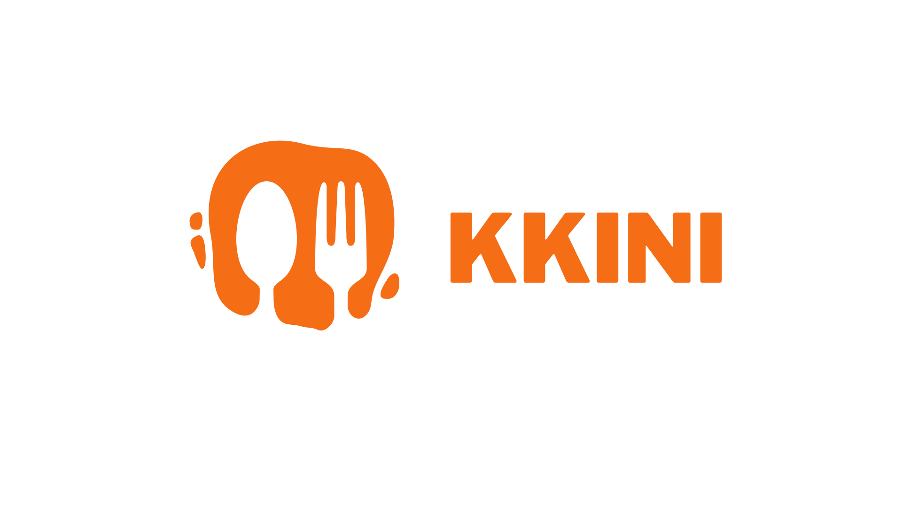
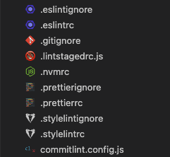
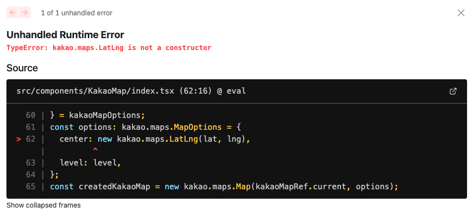
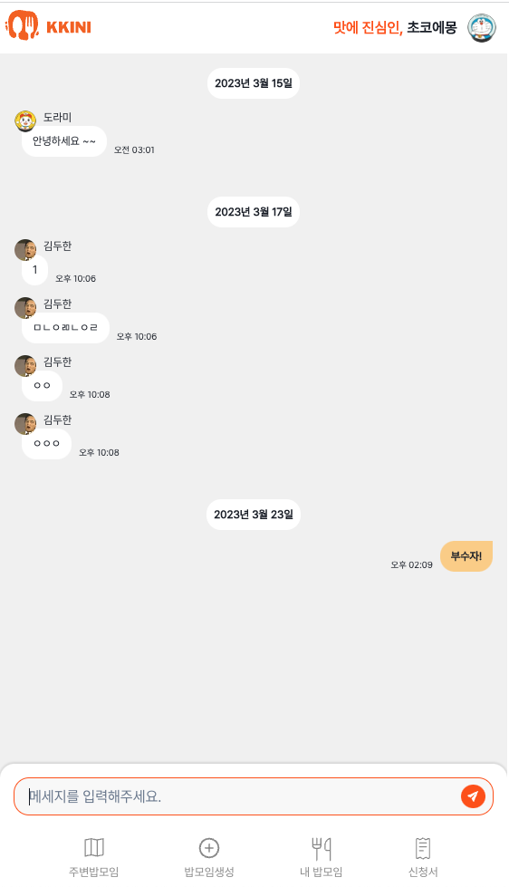

> 배고프면 합류하라! 위치기반 밥 친구 만들기 서비스 Kkini <br /><br/> KKINI는 동네에서 밥 친구를 만들고 싶은 사람, 혼자 가기 힘든 음식점을 가고 싶은 사람, 나만의 맛집을 공유하고 싶은 사람들이 모임을 결성하고 참여할 수 있는 서비스입니다.

<br />

3월 15일 수요일의 최종 발표를 마지막으로 데브코스를 수료했다. 처음엔 기획때문에 팀 분위기가 살벌해서 이번 프로젝트도 만만치 않겠다는 생각이 들었다. 하지만! 서로 잘 합의하여 기획 단계만 넘고 나니 정말 마법 같이 화기애애해졌다. 서로 선을 넘지도 않으면서 분위기도 유쾌하게 잘 흘러갔던 것 같다. 한 번 잘 부딪히고 나니 서로의 의견을 가감 없이 드러낼 수 있었고, 의견을 듣는 사람들 또한 이해와 배려를 가득 가지고 들어주었다. 그러면서도 좋았던 점은, 서로 잘못된 점은 확실하게 짚어주려 했다는 점이다.

공식적인 프로젝트 기간은 끝났지만, Kkini 서비스를 발전시키기 위해 계속해서 팀원들과 스프린트를 진행할 예정이다. 그 전에 내가 구현한 것, 배운 것들을 정리하고 넘어가면 뒤에 더 속도가 붙을 것 같아 이렇게 회고를 작성한다. KPT, 타임라인 등 여러 회고 작성법들이 있던데 원하는 내용들을 담는 게 어려울 것 같아 그냥 마음대로 적어보려 한다.

<br />

## 내가 구현한 것

팀원들에게 정말 미안하게도, 이번 프로젝트에서는 내가 많은 욕심을 부린 것 같다. 재미 있어 보이는 것들은 하고 싶다고 먼저 말하면서 다른 팀원들의 기회를 많이 날려버리지 않았나 싶다. 이 자리를 빌어 혹시 팀원들이 이 글을 본다면 꼭 미안하다는 말을 전해주고 싶다.

<br />

### 초기 프로젝트 셋팅

이전에 정글이라는 부트캠프에서 팀원과 같이 작업하면서 불편했던 점 중 몇 가지를 뽑자면 코드 포맷팅과 폴더 구조이다. 그 때는 그 팀원도 그렇고 나도 그렇고 eslint나 prettier가 무엇인지 전혀 몰랐다. 그리고 폴더 구조를 어떻게 하면 좋을지 크게 생각해보지도 않았던 것 같다. 조금만 시간을 들이면 다른 프로젝트들을 구경하면서 구조를 잡을 수 있었을텐데 말이다.

다행히 이번 프로젝트에서는 팀원 모두 협업 시 코드 일관성에 관심이 많았다. 그래서 처음에 서로 구조에 대해 적극적으로 얘기했었다. 최종적으로 현재 만들어진 폴더 구조는 다음과 같다.

```
src
 ┣ apis
 ┣ components
 ┃ ┣ ...
 ┃ ┗ common # Header, Navigation, Button 등 공통으로 쓰이는 컴포넌트 폴더
 ┣ contexts
 ┃ ┗ kakaoMap # kakao를 통해 만든 객체들을 context로 저장
 ┣ hooks
 ┃ ┣ ...
 ┃ ┗ query # useQuery, useMutation 등 react-query 훅 폴더
 ┣ pages
 ┃ ┣ food-party
 ┃ ┃ ┣ detail
 ┃ ┃ ┃ ┣ chat
 ┃ ┃ ┃ ┃ ┗ [roomId].tsx # 채팅방 페이지
 ┃ ┃ ┃ ┗ [partyId].tsx # 밥모임 상세 페이지
 ┃ ┃ ┣ list
 ┃ ┃ ┃ ┣ restaurant
 ┃ ┃ ┃ ┃ ┗ [placeId].tsx # 맛집으로 검색한 밥모임 목록을 페이지
 ┃ ┃ ┃ ┗ my.tsx # 자신이 참여 중인 밥모임 목록을 보여주는 페이지
 ┃ ┃ ┣ review
 ┃ ┃ ┃ ┗ [partyId].tsx # 밥모임 식사 완료 후 리뷰를 작성할 수 있는 페이지
 ┃ ┃ ┣ application.tsx # 자신이 다른 밥모임에 보낸 신청서, 자신이 만든 밥모임에 들어온 신청서 목록을 보여주는 페이지
 ┃ ┃ ┗ create.tsx # 밥모임을 생성하는 페이지
 ┃ ┣ user
 ┃ ┃ ┣ [userId].tsx # 나의 프로필 페이지
 ┃ ┃ ┗ edit.tsx # 나의 프로필 수정 페이지
 ┃ ┣ 404.tsx
 ┃ ┣ _app.tsx
 ┃ ┣ _document.tsx
 ┃ ┣ index.tsx
 ┃ ┗ oauth.tsx # 소셜 로그인 페이지
 ┣ services # useQuery, useMutation에 사용되는 비즈니스 비동기 로직 폴더
 ┣ stores # recoil로 저장하는 상태들을 정의하는 폴더
 ┣ styles
 ┣ types
 ┗ utils
 ┃ ┣ constants
 ┃ ┣ helpers
 ┃ ┗ validations
```

하지만 이 구조도 뭔가 부족하다는 생각이 들곤 한다. 어떤 걸 helpers나 validations에 둬야 하는가? 가끔 헷갈리곤 했다. 그래도 프로젝트를 진행하는 데에는 큰 문제를 일으키진 않았다고 생각한다.

코드 포맷팅을 위해 여러 툴들을 사용했다. ESLint, Prettier와 더불어 StyleLint, CommitLint, Husky, Lint-Staged까지 사용했다. 과한가..?라는 생각도 들었지만 할 수 있는 데까지는 해보고 싶었다. 덕분에 미약하지만 css 코드들의 순서도 팀원들과 통일할 수 있었고, feat을 feature로 써버리는 등 사소한 부분들을 방지할 수 있었다. 팀원들이 가끔 이러한 툴들의 사용에 대해 긍정적인 반응을 보여주면 뿌듯하기도 했다. 한 번 경험해보니 다음에는 더 타이트하게 가져갈 수 있지 않을까 싶다. 회사에 들어가서도 포맷팅이나 린팅이 잘 적용되어 있지 않다면 내가 한 번 적용해보고 싶다.



<br />

### 카카오맵 연결 및 랜덤 음식점 뽑기 기능 개발

가장 재밌었으면서도 고민을 많이 했으며 아쉽기도 했던 부분이다.

고민을 많이 했던 부분은 네이버, 카카오, 구글 이 3가지 Maps API 중 어떤 걸 사용할지였다. 크게 고려한 부분은 디자인과 정확성, 기능이었다. 구글 Maps의 경우 너무 어지럽다는 생각이 들어 디자인은 네이버와 카카오가 뛰어나다고 봤다. 그 다음 정확성은 네이버와 카카오라고 봤다. 우리나라를 대상으로 하다보니 음식점 정보를 업데이트 하는 데에 있어 네이버와 카카오가 더 신속하고 정확할 것이라고 보았다. 반면 기능은 구글이 가장 많이 보유하고 있었다. 음식점에 대한 리뷰 사진 뿐만 아니라 평점, 지금 영업 중인지 아닌지 등등 더 많은 정보를 제공해주었다. 출발지로부터 도착지까지 쉽게 경로 또한 그릴 수 있었다. 하지만 많이 사용하면 할수록 과금이 되는 형태였다. 한 달 200달러가 제공되는데 개발 중간 단계에서까지만 해도 거의 100 달러를 써버렸다. 욕심일 수 있지만 사용자가 조금만 늘어나도 돈이 많이 나올거라고 판단했다. 따라서 절충안으로 1일 30만회까지도 요청할 수 있는 카카오를 골랐다. 음식점 리뷰들의 사진들을 제공해주지 않고 기능들은 구글에 부족하지만 과금을 막을 수 있었고 사진은 카카오 Search API를 통해 어느 정도 보완할 수 있다고 판단했다. 그리고 무엇보다 네이버, 구글보다 공식 문서가 정말 잘 되어 있다는 인상을 받았다.

카카오맵은 다음 코드를 통해 띄웠다.

```typescript
const KakaoMap = () => {
  const kakaoMapRef = useRef<HTMLDivElement>(null);
  const { kakaoMap, setKakaoMap } = useKakaoMapContext();

  ...

  // 카카오맵을 생성하고 생성된 맵 객체를 context로 저장.
  useEffect(() => {
    kakao.maps.load(() => {
      if (!kakaoMapRef.current) return;

      ...

      const options: kakao.maps.MapOptions = {
        center: new kakao.maps.LatLng(lat, lng), // lat, lng는 강남역의 위도와 경도이다.
        level: level,
      };
      const createdKakaoMap = new kakao.maps.Map(kakaoMapRef.current, options);

      ...

      // 스크롤 줌/아웃 제한
      createdKakaoMap.setMinLevel(DEFAULT_MIN_LEVEL);
      createdKakaoMap.setMaxLevel(DEFAULT_MAX_LEVEL);

      ...

      setKakaoMap(createdKakaoMap);
    });
  }, []);

  ...

  return (
    <Box position='relative' width='100%' height='100%'>
      <div
        ref={kakaoMapRef}
        style={{
          width: '100%',
          height: '100%',
        }}
      />

      ...

    </Box>
  );
};

export default KakaoMap;

```

이 과정에서 겪은 이슈는 크게 2가지이다.

첫 번째는 script 태그를 통해 카카오 Maps 기능들을 다 제공하는 kakao.js를 다 불러오기 전에 kakao 메서드들을 사용하여 에러가 떴던 점이다. 위의 코드에서와 같이 kakao.maps.load를 사용하지 않으면 kakao.maps.LatLng 객체를 만드는 과정에서 다음과 같이 정의가 되어 있지 않기에 에러가 발생한다. kakao.maps.load(callback)는 kakao.js를 다 받아오고 나서 callback 함수가 실행될 수 있게 도와준다.



두 번째는 카카오맵이 중복 생성되어 사용자가 맵을 이동시키거나 확대/축소할 때 카카오맵이 겹치게 보이는 현상이었다. 이는 단순히 내가 의존성 배열을 잘못 작성하였기 때문에 벌어진 일이었다. eslint가 알아서 의존성 배열에 넣을 것들을 추천해주는데 당연히 이게 맞겠지~ 하면서 안일하게 생각했기 때문이다.

카카오 Maps API에서는 생성된 kakao map 객체를 삭제할 수 있는 메서드가 존재하지 않는다. 따라서 useEffect문에서 unmount할 때, 즉 return문에다가 기존 kakao map 객체를 삭제하는 코드를 삽입할 수 없다. 그렇기 때문에 kakao map 객체는 mount될 때에만 딱 1번 생성되어야 한다. 하지만 내가 의존성 배열에 빈 배열이 아니라 값이 들어간 배열을 작성했기 때문에, 그 값이 변하면 kakao.maps.load의 callback 함수에서 kakao map 객체를 다시 생성했고 이로 인해 여러 카카오맵이 화면 상에 보이게 되어 맵들이 겹치게 보이는 현상이 발생했던 것이다. 의존성 배열을 비움으로써 해당 현상은 말끔히 해결할 수 있었다.


카카오 Maps API 사용 경험은 정말 좋았다. 공식 문서도 깔끔했고 한국 전용이다보니 한글로 된 아티클들도 많아서 참고하기 편했기 때문이다. 하지만 다음에 다른 프로젝트를 할 때에는 구글 Maps API를 써서 더 많은 기능을 제공해보고 싶기도 하다.

<br />

### 채팅

실시간으로 대화하는 것이 아니라 비동기적으로 댓글을 통해 밥모임 인원들과 얘기하는 것은 답답함을 느끼게 만들 수 있어 사용자 경험을 저하시킨다고 생각했다. 중간에 누가 못 간다던가, 10분 늦는다던가, 갑자기 음식점이 닫아서 방장이 그걸 팀원들에게 말해줘야 된다거나 하는 등 여러 상황이 생길 수 있다고 생각했고, 댓글보다는 채팅을 통해 곧장 얘기를 나누는게 더 좋겠다고 판단했다. 그래서 처음부터 백엔드분들에게 웹소켓을 사용해 채팅을 구현하자고 제안하였다. 백엔드분들 모두 웹소켓을 처음 써보기에 조금은 주춤하셨지만 나중에 곧장 너무나도 잘 구현해주셨다. 화면만 잘 구현하면 될 정도여서 책임감을 느끼고 개발했다.

이전에 모 기업의 과제에서 채팅을 완벽하게는 아니지만 대강 구색은 갖춰서 만들어 봤었기에 자신감 있게 개발했다. 당연히 socket.io-client를 쓰면 되겠지?라고 안일하게 판단했었는데 막상 구현하려고 보니 SockJS와 StompJS를 써야했다. 전자는 NodeJS 전용이지만 후자는 자바-스프링 전용이기 때문이다. 다행히 크게 개념적으로 다른 부분은 없었던 것 같다.

프론트에서 채팅을 구현한 흐름을 설명하자면, 먼저 해당 밥모임에 대한 채팅방 페이지로 이동한다. 그러면 밥모임 고유 id를 바탕으로 채팅방을 생성하게 된다. 즉 밥모임 고유 id가 채팅 room id가 되는 셈이다. 들어가는 순간 데이터베이스에 저장된 기존의 메세지 이력들을 들고와 렌더링 시킨다. 이 때 조금 커스텀 한 부분은 날짜이다. 카카오톡을 참고하여 커스텀하였는데, 같은 날짜에 작성된 메세지들의 경우 날짜는 1번만 출력될 수 있게 하였다. 즉 다음과 같이 채팅 화면이 나올 수 있도록 구현했다.



어쨋든, 그렇게 기존의 메세지들을 데이터베이스로부터 가지고 와서 렌더링을 하면서 소켓 서버와 연결한다. connect가 정상적으로 이뤄지면 subscribe를 하게 된다. 이제 구독(subscribe)할테니 발행(publish)을 하면 나한테도 데이터를 날려달라는 것이다. 이렇게 구현하면 채팅방에 들어온 다른 사람들이 메세지를 보내면, 즉 publish(send)하면 나는 그 데이터를 즉각적으로 받아서 기존의 state에 더하면 해당 메세지를 화면에 보여줄 수 있다. 나도 보낼 때 send 메서드를 사용하면 다른 사람들의 채팅방 화면에 나의 메세지가 출력되게 된다.

<a href="https://github.com/prgrms-web-devcourse/Team-DarkNight-Kkini-FE/blob/develop/src/pages/food-party/detail/chat/%5BroomId%5D.tsx" target="_blank" rel="noreferrer noopener">채팅 코드 링크</a>

> 코드가 조금 복잡할 것 같아 그냥 깃헙 링크를 달아뒀습니다.

socket.io-client에 대한 글들은 많아서 참고하기 좋아보였던 반면, SockJS와 StompJS에 대한 글들은 적어 구현하는 데에 시간이 조금 걸렸던 것 같다.

<br />

### 밥모임 목록, 상세 페이지

처음엔 NextJS의 `getServerSideProps`를 통해 서버사이드 렌더링으로 페이지를 구현해야겠다는 생각을 했다. 밥모임에 대한 상세 정보가 SEO에 노출되어도 괜찮다고 생각했고 client side에서 fetch하는 것 보다 렌더링에 필요한 데이터들을 서버에서 미리 fetch하여 보여주는 것이 더 빠르겠다는 생각이 들었기 때문이다. 하지만 기획도 바뀌고(밥모임 상세 페이지는 로그인하지 않으면 못 들어가게 바뀌었다) 특히나 getServerSideProps, 즉 서버 측면에서 cookie에 담긴 refresh token을 가지고 오지 못해 로그인 권한이 필요한 API를 호출할 수 없었다. 같은 팀원과 수많은 시도를 했지만 프로젝트 마감까지는 해결할 수 없는 문제라고 판단하여 과감히 getServerSideProps를 버리기도 결정했다.

어쨋든! 밥모임 목록 페이지는 랜덤 맛집 드로어를 통해서 들어갈 수도 있고, 밥모임 커스텀 오버레이를 눌러서도 들어갈 수 있으며, 네비게이션 바의 내 밥모임 버튼을 클릭해서도 들어갈 수 있다. 각 경로마다 필요한 데이터가 다를 뿐, 화면의 구조는 거의 동일했고 첫 번째로 말한 랜덤 맛집 드로어를 통해 들어가는 경우를 제외하고는 다른 팀원들이 개발하였기에 잘 이해할 수 있도록 적어놓는 것이 중요하다고 생각했다.

기본이겠지만 다음과 같이 page 컴포넌트에서만 API를 호출하는 로직을 작성했고 밥모임 리스트들은 List, ListItem으로 컴포넌트를 나누어서 작성했다.

```typescript

...

type SearchedFoodPartyListProps = SearchedFoodPartyListQuery;

const SearchedFoodPartyList = ({
  placeId,
  name,
}: SearchedFoodPartyListProps) => {
  const {
    data: foodPartyList,
    isLoading,
    error,
    isSuccess,
  } = useGetSearchedFoodPartyList(placeId);
  const { randomRestaurant } = useRandomRestaurantContext();
  const setSelectedRestaurant = useSetRecoilState(selectedRestaurantState);
  const router = useRouter();
  const handleClickFoodPartyItem = (partyId: number) => {
    router.push(ROUTING_PATHS.FOOD_PARTY.DETAIL.INFORMATION(partyId));
  };
  const handleClickCreateFoodPartyButton = () => {

    ...

  };

  if (isLoading) return <FoodPartyListSkeleton foodPartyCount={2} />;
  if (error) return <GoHomeWhenErrorInvoked />;

  return (
    <>
      {isSuccess ? (
        <Flex flexDirection='column' padding='1rem'>
          <Heading paddingBottom='1rem'>{name}의 밥모임</Heading>
          <FoodPartyList
            isMyFoodParty={false}
            foodPartyList={foodPartyList}
            onClickViewButton={handleClickFoodPartyItem}
            onClickCreateFoodPartyButton={handleClickCreateFoodPartyButton}
          />
        </Flex>
      ) : (
        <GoHomeWhenErrorInvoked />
      )}
    </>
  );
};

export default SearchedFoodPartyList;

// eslint-disable-next-line @typescript-eslint/require-await
export const getServerSideProps: GetServerSideProps = async context => {
  const { placeId, name } = context.query;

  return {
    props: {
      placeId,
      name,
    },
  };
};
```

로딩 중일 때는 사용자에게 대략적으로 어떤 화면이 구성되는지 보여줄 수 있도록 spinner보다는 skeleton을 사용하였다. 그리고 API를 호출하는 과정에서 error가 발생하면 에러 컴포넌트가 뜨도록 하여 Home으로 돌아가 다시 서비스를 사용할 수 있도록 하였다. 여기서 getServerSideProps를 사용한 이유는 단순히 query string들을 컴포넌트 함수에 처음부터 undefined가 되지 않게 넘겨주기 위함이다. 단순히 useRouter를 사용해서 query string을 받아오면 처음엔 undefined가 뜨기 때문에 useEffect를 사용해야 하는데 이러한 번거로운 과정을 없애기 위해 getServerSideProps를 사용했다.(이 글을 쓰면서 확인해보니 그러지 않아도 될 것 같다. Next 10.0.5 이상부터는 처음 렌더링 시 undefined가 아닌 것 같다. 리팩터링에 반영하도록 해야겠다. 배포하고 보니 getServerSideProps를 사용한 페이지로 넘어갈 때 상당히 느렸는데 getServerSideProps를 안 쓸 수 있게 되면 오히려 좋은 것 같다.)


---

<br />

## 팀원들에게서 배운 것

실명을 밝혀서 미안합니다. ㅎㅎㅎ

- 동우: 동우에게 배운 건 의견 조율이었다. 프로젝트 초기 기획 때 백엔드분들과 의견이 합쳐지지 않았는데 이 분열을 합치는 데에 결정적인 역할을 해준 것이 동우였다. 동우는 자신의 입장과 생각만 내세우는 사람이 아니라 다른 사람과 어떻게 융화되고 합쳐질 수 있을지 생각할 줄 아는 사람이었다. 이번 프로젝트는 꼭 내 의견을 내세우고 싶었고 욕심을 많이 부렸어서 이런 측면을 보지 못했었는데 동우를 보면서 내가 무엇을 못 보고 있었는지 깨달을 수 있었다.

- 수화: 수화는 팩트를 따질 줄 알고, 순간순간마다 무엇이 옭고 그른지 판단하는 감각이 뛰어난 팀원이라고 생각했다. 상대적으로 개발 지식 또한 뛰어나고 그만큼 개발을 잘한다는 인상을 받았다. 특히 코드 리뷰에서 많은 존경심을 가졌다. 감정이 절제될 수 있는 텍스트로 전달하다보니 상세히 코드리뷰하는 것이 꺼려지곤 했었는데 수화가 해준 조언 덕에 나도 코드리뷰를 상세히, 그리고 더 열심히 할 수 있게 된 것 같다.(대략, 지금 상세히 물어보고 지적해놓아야 나중에 그 사람이 아닌 내가 그 코드를 가지고 개발할 때 생산성을 높일 수 있다라는 조언이었다.)

<br />

## 새로 배운 것

<br />

## 아쉬웠던 점들

다음엔 atomic design 등 디자인 패턴을 염두에 두고 설계를 하는 건 어떨까라는 생각이 든다.

<br />

## 그 밖의 겪은 이슈

배포할 때 돈 내버린 것

<br />

## 달라진 점

속에 담아 두지 않고 의견을 전달할 수 있다.

## 느낀 점

이제는 회사에 들어가고 싶다.

나는 과연 같이 개발을 이어나가고 싶은 팀원이었을까?라는 생각을 가져보았는데 객관적으로 10점 중에 6 ~ 7점은 되지 않았나 싶다. 나름 사용자 측면을 고려하여 제안한 기능들과 UI들이 잘 먹혔다고 판단하고 자유롭게 의견을 말할 수 있는 분위기 형성에도 일조했다고 생각하기 때문이다. 그리고 많은 기능들을 빠르게, 그리고 많이 개발했다고 생각한다.

하지만 몇몇 에러들은 시간이 부족하다는 핑계로, 중요하지 않을 수도 있다는 생각으로 눈 가리고 아웅해버렸다. 초반엔 너무 내 의견만 내세우기도 했던 것 같고 가끔은 솔직하게 말해서 귀찮음을 느껴서 다른 사람의 의견에 귀 기울이지 않고 그냥 동의해버리도 했다. 따라서 10점 중 3 ~ 4점을 빼버렸다. 매 순간 집중해야 나중에 고생하지도 않고 고생시키지도 않음을 명시해야겠다.

## 앞으로

Google Analytics
먼저 PWA 적용 후 구글 스토어에 배포
성능 측정
인피니트 스크롤 적용하기(백엔드분들이 기껏 열심히 만들어주셨는데 써먹지 못했다.)
