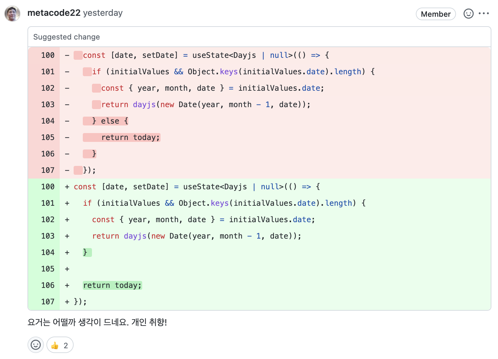
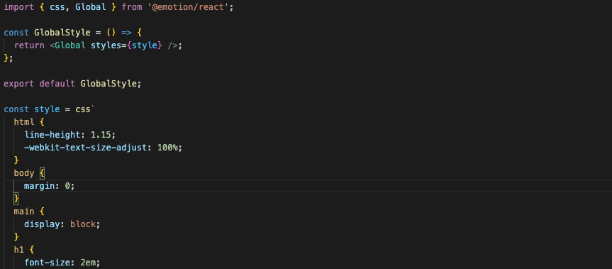
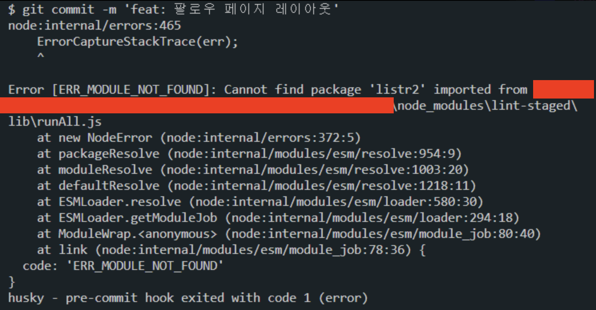
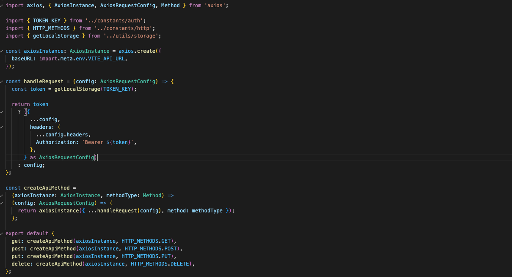
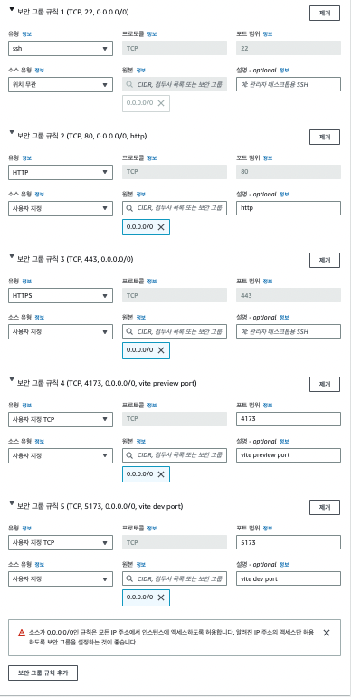
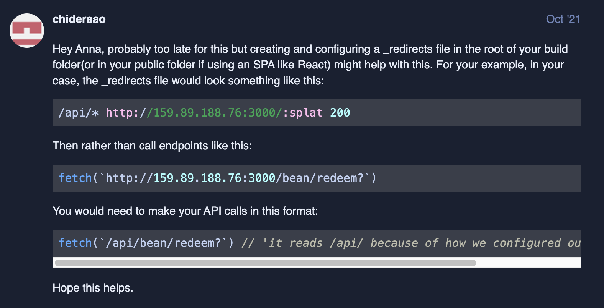
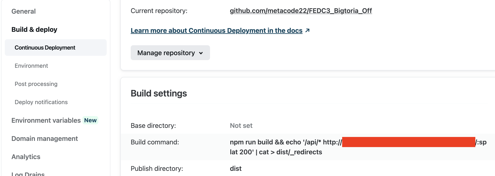
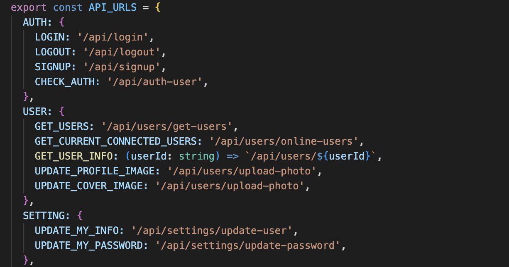

> 잘 만들어진 백엔드 api를 바탕으로 프론트엔드를 구성하는 팀 프로젝트를 진행했습니다.

## 셋팅

### React

SPA 구현을 위해 React를 선택했다. 데브코스에서는 React와 Vue를 배울 수 있는데, React에 익숙한 사람이 더 많았기에 자연스럽게 React를 선택하게 되었다.

<br />

### Vite

React 프로젝트는 Vite로 만들었다. 이전에 한 번 맛보기로 경험해봤었는데 CRA보다 많이 빠르고, CRA에서 당장은 불필요하다는 생각이 드는 것들이 생략되었다고 느꼈었다. 그래서 팀원들에게 Vite로 만들자고 제안했었는데 다행히 팀원들 모두 동의해주었다. 그리고 한 팀원분이 아주 잘 셋팅된 vite 보일러 플레이트를 이전에 만들어두어서 이를 이용해 아주 손쉽게 시작할 수 있었다.

<br />

### TypeScript

TypeScript는 꼭 한 번 적용해서 제대로 경험해보고 싶었다. 오류를 줄일 수 있고 더 나은 개발자 경험(자동으로 메서드나 속성을 리스트업 해주는 등)을 제공한다는데 이를 제대로 느껴본 적은 없었다. 그래서 사용하고 싶었다.

<br />

### Emotion

Emotion과 비교해서 가장 많이 언급되는 것으로는 styled-components가 있다. 둘 다 styled를 사용할거면 사용방법은 거의 동일하다. 성능 차이도 유의미할 정도는 아닌 것으로 알고 있다. 또한 우리 팀은 emotion의 css props 문법을 사용하지도 않을 거라서 둘 중 아무거나 고르면 된다고 생각했다. 그래서 데브코스 강의에서는 emotion을 경험했으니 더 익숙한 emotion을 선택했다. 만약 Next.js를 사용했다면 emotion을 바로 선택했을 것 같다. 서버 사이드 렌더링을 위해 styled-components는 따로 설정이 필요하나 [emotion은 그러지 않아도 되는 것](https://emotion.sh/docs/ssr#nextjs)으로 알고 있다.

<br />

### Axios

fetch, axios, ky 3개 중 1개를 고를 생각이었다. 번들 사이즈가 적고 사용해본 적이 없는 ky를 경험해보고 싶은 생각이 들었던 반면, 프로젝트 수행 기간이 짧기에 러닝 커브가 존재한다는 단점이 생각 났다. 또한 레퍼런스가 적을 것 같아 제일 먼저 제쳐두었다. 남은 fetch와 axios 중에서 아무거나 되어도 상관없다는 생각이 들어 이건 팀원들의 결정에 따라가고 싶었다. 그래서 axios를 선택하게 되었다. 이전에 axios instance를 나름 효과적으로 만든 코드를 본 적이 있어 이걸 적용하게 되었는데 이 때 axios의 장점을 다시 느낄 수 있었다.

`axiosInstance.ts`

```typescript
import axios, { AxiosInstance, AxiosRequestConfig, Method } from 'axios';

import { TOKEN_KEY } from '../constants/auth';
import { HTTP_METHODS } from '../constants/http';
import { getLocalStorage } from '../utils/storage';

const axiosInstance: AxiosInstance = axios.create({
  baseURL: import.meta.env.VITE_API_URL,
});

const handleRequest = (config: AxiosRequestConfig) => {
  const token = getLocalStorage(TOKEN_KEY);

  return token
    ? ({
        ...config,
        headers: {
          ...config.headers,
          Authorization: `Bearer ${token}`,
        },
      } as AxiosRequestConfig)
    : config;
};

const createApiMethod =
  (axiosInstance: AxiosInstance, methodType: Method) =>
  (config: AxiosRequestConfig) => {
    return axiosInstance({ ...handleRequest(config), method: methodType });
  };

export default {
  get: createApiMethod(axiosInstance, HTTP_METHODS.GET),
  post: createApiMethod(axiosInstance, HTTP_METHODS.POST),
  put: createApiMethod(axiosInstance, HTTP_METHODS.PUT),
  delete: createApiMethod(axiosInstance, HTTP_METHODS.DELETE),
};
```

이렇게 설정해두면 해당 인스턴스를 가지고 api를 작성할 때 method: 'GET', method: 'PUT'와 같은 method 속성을 따로 넣어주지 않아도 된다. 그리고 baseURL을 설정해두어서 계속해서 api url 또한 안 넣어도 된다. 그리고 중간에 handleRequest 함수를 통해 token을 검사하여 config에 token을 넣어줄 수도 있다. 이 인스턴스를 가지고 api를 작성하게 되면 비교적 많은 코드를 줄일 수 있게 된다.

`example.ts`

```typescript
import { API_URLS } from './../constants/apiUrls';
import http from './instance';

export const getStoriesOfUser = async (userId: string) => {
  const { data: stories } = await http.get({
    url: API_URLS.POST.GET_POSTS_OF_SPECIFIC_USER(userId),
  });

  return stories;
};
```

위와 같이 http라는 이름으로 인스턴스를 가져와 api를 작성했다. baseURL에 붙을 부가적인 api url만 넣어주면 되는 api다. 인스턴스를 사용하지 않았다면 token을 가지고 오는 로직도 작성해야 하고 method, 더 긴 api url을 config에 넣어줘야 될 것이다.

지금 보니 axios의 interceptor를 handleRequest라는 로직을 구현하여 대체했다는 느낌이 든다. 다음엔 interceptor를 사용해서 구현해봐야겠다.

<br />

### SWR

채팅과 알림, 현재 접속 중인 사용자 목록을 구현해야 하는데 api 문서를 보니 따로 소켓 서버는 없는 것 같았다. 그래서 떠올린 것은 SWR과 React Query였다. 둘 다 일정 주기를 바탕으로 refetch를 할 수 있다. 마치 실시간으로 통신하는 듯이 모방하여 사용자에게 실시간 경험을 제공하는 것이다.

물론 useEffect 안에 setInterval을 넣어 쌩으로 구현할 수도 있을 것이다. 하지만 그러면 코드가 복잡해질 수 있고 캐싱도 되지 않아 비효율적이라는 생각이 들었다.(캐싱도 코드로 작성하면 머가리 깨질 듯!) 반면 SWR과 React Query는 캐싱 기능을 제공한다.(사실 아직 어떤 부분에서 캐싱이 되는 것인지는 정확하게 파악하지 못했다! 헤헷! 다른 곳에서 이미 네트워크 요청을 했으면 이를 캐시에 저장해두고, 또 다른 곳에서 동일한 네트워크 요청이 일어났을 때 새로 요청하지 않고 캐싱된 데이터를 가져다 쓰지 않을까라는 추측은 했었다. 그러면 요청을 줄일 수 있으니까!)

SWR과 React Query 둘 중 하나를 선택해야 했는데 SWR로 기울었다. 복잡하게 사용해야 하는 것이 아니라 그저 데이터 페칭을 주기적으로 하기 위한 간단한 솔루션이 필요했는데 여러 아티클에서 공통적으로 말해주는 것이 간단한 솔루션에는 SWR을 추천했기 때문이다. 이유는 번들 사이즈가 React Query에 비해 3 ~ 5배 정도 적기 때문이지 않을까 싶다.

[SWR 번들 사이즈](https://bundlephobia.com/package/swr@2.0.0) VS [React Query 번들 사이즈](https://bundlephobia.com/package/react-query@3.39.2)

그리고 내가 이전에 사용해봤었기 때문에 러닝 커브가 비교적 적을 것이라 판단했다. 공식 문서도 한글로 비교적 잘 되어 있고 지금과는 달리 이전에는 SWR이 더 안정적이었기에 SWR을 적용한 제품이 많아 레퍼런스 또한 충분하다는 생각이 들었다.

반면 아쉬운 점도 있다. React Query는 가비지 컬렉션을 알아서 해주지만(cacheTime 속성을 통해 가비지 컬렉션 주기 또한 설정할 수 있다) SWR은 그렇지 않다. Dev Tools도 React Query는 해당 패키지에서 바로 제공하지만 SWR은 따로 패키지를 다운로드해야 한다. 인피니트 스크롤을 구현할 때에도 React Query가 더 많은 기능을 제공해 구현하기 쉬워진다.

이러한 점에서 React Query가 요즘 전반적으로 더 잘 나가는 듯 하다. 하지만 우리 프로젝트에서는 SWR이 더 간단하고 적절하다는 판단이 들어 SWR을 선택하게 되었다.

> 레퍼런스

[데이터 가져오기를 위한 React Hooks - SWR](https://swr.vercel.app/ko)

[데이터 가져오기 - SWR](https://swr.vercel.app/ko/docs/data-fetching)

[React에서 서버 데이터를 최신으로 관리하기(React Query, SWR)](https://fe-developers.kakaoent.com/2022/220224-data-fetching-libs/)

[useSWR vs. React Query - Differences and which one should you choose?](https://codedamn.com/news/javascript/useswr-vs-react-query-differences-and-which-one-should-you-choose)

[React Query vs SWR](https://goongoguma.github.io/2021/11/04/React-Query-vs-SWR/)

<br />

### 포맷팅 툴

코드 포맷팅을 위해서 eslint와 prettier를 사용했다.

대부분의 진행 상황 내용을 적는 곳으로는 github repo의 issues를 활용했고, 여기에 담기 어려운 것들은 노션을 활용하는 형태로 진행하고 있다. 그리고 PR을 통해 서로의 코드에 대해 얘기하는 편이고, 즉각적으로 코드나 자료를 공유해야하거나 에러 해결을 위해서는 슬랙과 디스코드를 활용하고 있다.

<br />

## Git 전략

git flow를 아주 간소화했다. 간단하게 표현하자면 main -> develop -> 작업할 브랜치들

작업 브랜치에서 develop으로 합쳐가고 배포를 할 때에는 main에다가 할 셈이었다.

대략 이런 느낌?


ㅎㅎㅎㅎㅎ 하지만 배포 과정에서 조금 문제가 있어 정확히 위와 같지는 않을 것 같다. 아마 deploy 브랜치를 따로 팔 수도 있을 것 같다.

작업은 원본 레포에서 issue를 작성하고 fork한 레포의 develop 브랜치에서 작업 브랜치(ex. feature/make-header-component)를 파서 원본 레포의 develop 브랜치로 pr을 날리는 방식으로 진행했다. 이렇게 하니 원본 레포의 develop에서 merge된 작업물들을 검사하고 난 후 원본 레포의 main으로 날릴 수 있으니 더 안전해진다는 생각이 들었다. 또한 fork한 나의 레포에서는 마음대로 할 수 있으니 자유도 또한 높아졌다고 느꼈다.

<br />

## 코드 리뷰

다들 적극적으로 코드리뷰를 해주어서 정말 감사했다! 칭찬을 해주기도 하고 잘못된 부분은 잘 짚어주어서 적절하게 고쳐나갈 수 있었다.

코드리뷰에서는 그냥 평소 하던 방식으로 한 것 같다. 가끔은 이전 멘토님이 알려주신 [뱅크샐러드의 Pn 룰](https://blog.banksalad.com/tech/banksalad-code-review-culture/)을 적용하기도 했다. 어떻게 하면 더 부드럽게 말하면서도 내 의견을 잘 전달해줄 수 있을지 여러가지 시도해봐야겠다.

새로 시도해본 것은 [github의 suggestion 기능](https://nesoy.github.io/articles/2019-11/Github-suggestion)이었다. 사용해본 적은 거의 없었는데 이번에 익숙해지니 좀 더 내가 생각한 코드를 잘 전달할 수 있어 좋았다.


<br />

## 문제들

후... 일주일간 겪었던 문제들을 적고 싶었지만... 자연스럽게 반성하게 된다. 구현에만 너무 급급했던 나머지 따로 정리를 안해서 기억이 나지 않는다. ^.^ 억지로 끄집어 내봐야겠다.

<br />

### emotion-normalize 적용 시 출력되는 경고 문구

처음엔 다음과 같이 emotion-normalize를 적용하려고 했다.

```typescript
import { css, Global } from '@emotion/react';
import emotionNormalize from 'emotion-normalize';

const GlobalStyle = () => {
  return <Global styles={style} />;
};

export default GlobalStyle;

const style = css`
  ${emotionNormalize}
`;
```

근데 이렇게 하면 다음과 같은 경고 문구가 발생했다. 대강 '너 왜 @emotion/react 또 불러오니? 있잖아유!'하는 것 같다. emotion-normalize와 기존에 깔린 @emotion/react와의 충돌때문인 것 같다. 혹시나 해서 emotion-reset도 해봤는데 그대로였다.

[emotion의 깃헙 이슈](https://github.com/emotion-js/emotion/issues?page=2&q=you+are+loading)에서 검색해도 딱히 해결법은 찾지 못했다. 영어가 많으니 무섭다. ㅎㅎㅎ

그래서 [emotion-normalize 레포](https://github.com/infinum/emotion-normalize/blob/master/src/index.js)의 normalize css 내용을 그대로 가져와 붙여서 해결하였다! 다행히 경고문구도 사라지고 적용도 잘 된 것을 확인할 수 있었다.


<br />

### 팀원 간 node 버전 불일치 문제



팀원 1명이 commit 할 때마다 위와 같은 에러가 발생하여 commit을 못하고 있었다. package-lock.json이나 node_modules를 지웠다가 다시 설치하기도 하고 다시 git clone을 받아서 npm install을 해보기도 했지만 현상은 여전했다. 그러던 와중 검색하다가 우연히 어떤 블로그를 봤는데(출처를 못 찾겠다) 그 글을 보고 node 버전이 서로 일치하지 않아서 발생할 수도 있는 문제라는 생각이 들었다. 확인해보니 대부분의 팀원은 18.12.1 버전이었던 반면 에러가 발생한 팀원의 node 버전은 16이었다. 바로 nvm을 통해 18버전으로 바꾸고 package-lock.json이었나 node_modules를 지우고 다시 npm install을 하니 에러가 사라졌었다.

그래서 프로젝트 시작 시 node 버전을 맞추고 가는 것도 좋은 방법이라는 생각이 든다. .prettierrc, .eslintrc처럼 [.nvmrc 파일을 만들어 일치](https://mong-blog.tistory.com/entry/NVM-%EB%B2%84%EC%A0%84-%EC%84%A4%EC%A0%95-%EC%89%BD%EA%B2%8C-%ED%95%98%EA%B8%B0with-nvmrc?category=967416)시킬 수 있는 것 같다.

<br />

### TypeScript

타입스크립트 덕분에 초반에도 그렇고 지금도 힘들다. 근데 무엇 때문에 힘든지 딱 말해서 짚을 수가 없다... 갑자기 생각치 못하게 타입 에러가 뜨면 정신이 아득해진다. 그러다가 검색을 통해 땜빵하듯이 일단 해결하는데 깊게 이해하지 못할 땐 내 자신이 한 없이 부끄러워진다. 별 거 아닐 줄 알았기 때문! 강의도 듣고 공식 문서도 참고하면서 심도 있게 이해해봐야겠다.

타입 때문에 힘들었던 것 중 기억 나는 건 다음 경우이다.


워호우... 에러 메세지도 너무 길고, 내가 vscode를 영어로 설정해놔서 더 당황스러웠다. 사실 지금도 뭐가 문제인지 정확히는 모르겠다. 추측하기로는 axiosInstance에 AxiosRequestConfig 타입의 config 인자가 들어가야 하는데, handleRequest를 통해 반환된 값 중 빨간색 값은 내가 커스텀하였기에 AxiosRequestConfig 타입이 아니게 되어 발생한 에러지 않을까 싶다.

실제로 위 상태에서 handleRequest 함수의 반환값 타입을 보면 다음과 같다.


AxiosRequestConfig이거나 커스텀하여 만들어진 config 타입이 반환되는 것을 확인할 수 있다.

해결방법은 생각보다 단순했다. as를 사용하는 것!


'이 값은 내가 조금 변경시키긴 했는데, 그래도 타입은 AxiosRequestConfig야~ 라고 말해주는 것이다.'

같이 데브코스를 진행하고 있는 착하고 재밌으면서 잘생긴 분한테서 답을 얻을 수 있었다. 민종쨔이 쵝오!

이 밖에도 로직 구현 등 문제가 있었으나 일단 기억나는 것만 적어보았다.

<br />

## 배포

배포는 짜릿한 반면에 어렵고 두려운 놈이다. 백엔드분들에게도 마찬가지일까?

생각보다 많이 헤매서 힘들었다... 한글 아티클에서는 비슷한 사례가 잘 보이지 않아서였다.

길었던 배포 과정은 다음과 같은 순서로 진행했다.

> **vercel -> meta 태그 적용 -> netlify -> s3 -> ec2 -> netlify**

### vercel

배포에서는 무슨일이 생길지 모르기에 프로젝트 작업에 들어가고 나서 5일차인 금요일 어제 바로 배포를 시도하게 되었다. 먼저 vercel로 진행했는데 역시 예상처럼 쉽게 되지 않았다.


위와 같이 404 에러가 떴다. 우리 팀에서 추측하기로는, vercel로 배포하면 기본적으로 api 요청을 할 때 https로 날리기 때문에 발생한 에러로 생각했다. 백엔드 api는 http이기 때문이다.

<br />

### meta 태그

대강 검색해보니 다음과 같은 코드를 `index.html`에 넣어 해결했다는 글들을 보았다. 그래서 시도해봤다.

```html
<meta
  http-equiv="Content-Security-Policy"
  content="upgrade-insecure-requests" />
```

위 태그를 삽입하고 vercel로 다시 시도했지만 결과는 똑같았다. 뭐가 문제인지 이 때부터는 진짜 모르게 되었다.

<br />

### netlify, s3

혹시나 해서 netlify에 올려도 동일했고 s3에 올려도 동일했다.(build해서 dist 폴더의 파일들을 s3에 올리면 아예 아무것도 안 떴다...)

<br />

### ec2

이번엔 아예 프론트엔드를 http로 바꾸자는 생각이 들었다. 그래서 시도한 것이 ec2였다. 대강 ec2 서버 시도는 다음과 같이 진행했다.

1. ubuntu 서버 생성
2. 네트워크 설정
   
3. 서버 접속해서 배포할 레포 `git clone`
4. 다음 명령어 입력
   `sudo apt-get update`
   `sudo apt-get install curl`
   `curl -sL https://deb.nodesource.com/setup_16.x | sudo -E bash --`
   `sudo apt-get install -y nodejs`
5. 해당 폴더로 접속해서 `npm install`
6. `npm run build`

근데 여기서 문제가 발생했다. (여기까지 오는데에도 좀 헤맸다. ㅎㅎㅎ)

대강 해석하기론 힙을 다써서 꺼져버린 것 같다. 프리 티어 서버의 한계인가... 그래서 다른 방법을 생각해낸 것이 있다.

로컬에서 npm run build를 한 후 dist를 .gitignore 파일에서 제거하여 빌드된 dist를 그대로 레포에 올려버리는 것이다. 다음 순서로 진행했다.

1. 로컬 레포에서 npm run build
2. .gitignore 파일에서 dist 제거
3. 로컬 레포로 push
4. ec2에서 git pull origin 해당 브랜치
5. npm run preview
6. `ec2 public ip`:4173 접속, 안되면 :80으로도 접속

[preview가 dist 폴더를 돌리는 것](https://vitejs-kr.github.io/guide/static-deploy.html#deploying-a-static-site)으로 알고 있어 혹시나 이렇게 해봤는데 역시나 안된다. ㅎㅎㅎㅎㅎㅎ 설마해서 dev 서버 돌려도(5173) 접속이 안된다.

1. npm run dev
2. `ec2 public ip`:5173 접속

안된다! ec2가 힘들 걸 예상은 했는데 막상 안되니까 허무하다... 아무래도 내가 서버를 제대로 못 돌리고 있는 것 같다.

### netlify

마지막으로 본 [한 아티클](https://answers.netlify.com/t/how-to-send-http-request-in-netlify-app/40604/8)에서 다음 방법을 발견했다. 그래서 다시 netlify로 돌아오게 되었다.



이것만 하고 그냥 자야겠다라는 생각으로 시도했다. 위 방법을 시도하기 위해서 vite에서는 좀 다르게 해줘야 한다.


redirects 파일을 루트 디렉토리에 만들어도, vite 환경에서는 build를 통해 redirects 파일이 dist 폴더로 들어가지 않기 때문에 위와 같이 해주었다.(빨간색 네모는 api end point) 원래는 package.json의 scripts에다가 작성했었는데 팀원의 조언 덕분에 위와 같이 작성하여 코드 상에서도 api end point를 숨길 수 있게 되었다.

추가로 새로고침 시 404 페이지가 뜨는 것을 방지하기 위해 netlify.toml 파일을 만들어 다음과 같이 코드를 작성했다.

```
[[redirects]]
  from = "/*"
  to = "/index.html"
  status = 200
```

그 다음에 api 요청을 보낼 때 모두 api라는 단어를 다음과 같이 붙여주었다. 인스턴스에서 baseURL에 붙여주면 될 것 같았는데 그건 이상하게 안 먹혔다... 그래서 다음과 같이 그냥 일단 다 노가다로 작성했다.



이러고 배포하니까 된다! 지금까지 확인한 바로는 네트워크 요청 시 api end point도 잘 숨겨진 것 같다. 기능적으로 완성은 아주 아주 덜 되었지만 그래도 배포가 되어서 다행이다...

하지만 개발 서버에서는 동작하지 않는다. api라는 이름이 앞에 붙어버리기 때문이다. 따라서 배포를 위해 deploy라는 이름으로 브랜치를 따로 파게 되었다.

<br />
