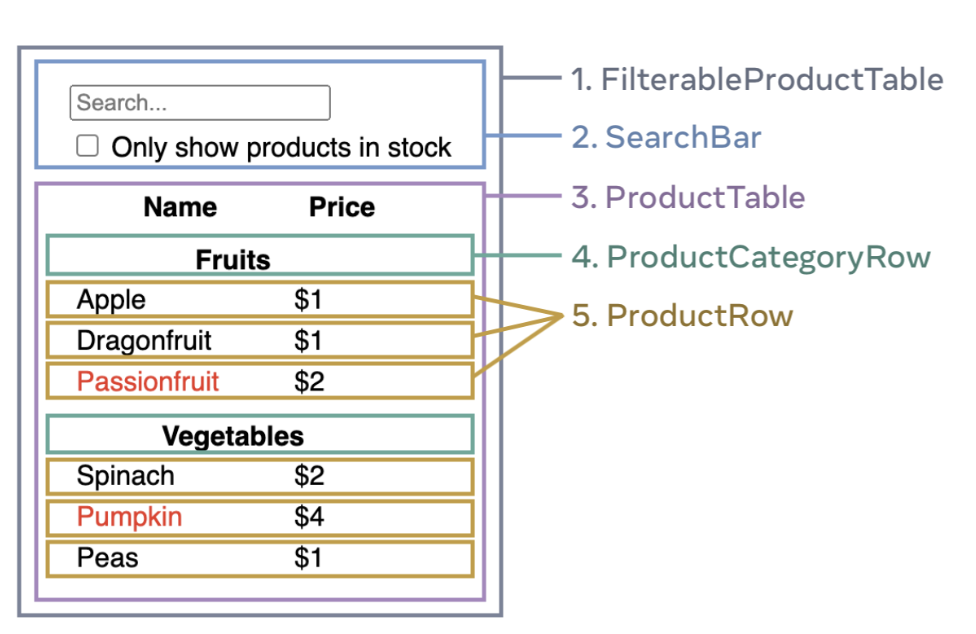

React의 새로운 공식 문서가 런칭되었다. 그러면서 기존의 React 문서는 legacy라는 이름이 URL에 붙게 되었다. 왜 React는 새로운 공식 문서를 만들었을까?

- React Hooks에 대한 혼란스러움 감소: 기존 문서에서는 React Hooks에 관해 클래스형 컴포넌트와 함수형 컴포넌트 2번에 걸쳐 학습해야 했다. React Hooks가 나온 2018년에는 대부분의 사용자들이 클래스형 컴포넌트에 익숙했기 때문이다. 하지만 최근에는 함수형 컴포넌트를 사용하는 경우가 대다수이기에 새로운 문서에서는 React Hooks에 대한 설명으로 함수형 컴포넌트에 집중했고, 이를 통해 독자들의 혼란스러움을 감소시켜준다.
- 이전 컨텐츠와 명확한 구분: React가 나온지 10년이 지났다. 그만큼 많은 기능들이 추가되었고, Next, Remix, Gatsby와 같은 React 기반의 프레임워크도 많이 생겨났다. 이렇게 추가된 것들을 새로운 문서에 적극적으로 담았다.

아직 많이 읽어보진 않았지만 내가 느끼는 점은 이전 문서와 달리 공식 문서를 참고하기가 덜 꺼려진다는 것이다. 이전 문서는 구린 UI와 사용하지 않을 클래스형 컴포넌트로 예제가 구성되어 있어 참고하기가 꺼려진다. 하지만 새 문서에서는 현대 디자인에 맞게 UI가 설계된 느낌이 들고 예제 또한 함수형 컴포넌트로 구성되어 있어 대다수의 React 사용자들과 최근 React를 배우기 시작하는 사람들에게도 적절하겠다는 생각이 들었다. React의 단점으로 공식 문서가 지적되곤 했었는데 이젠 Vue에 버금가는, 어쩌면 더 나은 공식 문서를 가지게 될 수 있지 않을까 기대된다.

최근 프로그래머스 데브코스를 수료한 동기들과 이 새로운 React 문서를 바탕으로 스터디 진행을 제안했는데 다들 흔쾌히 참여해주었다. 이왕 하는 거 제대로 하기 위해 블로그에 차근차근 올려볼 예정이다.


> <strong>- 주의 -</strong> <br /> 정리하면서 저의 생각도 많이 넣는 편입니다. 혹시나 제 글을 읽으실 때 아리송한 부분이 생기신다면 해당하는 공식 문서를 꼭 참고하시길 바랍니다. <br /> 또한, 저에게 익숙한 내용들은 생략하고 정리합니다.

## React Beta Docs에서 말하는 UI를 구성하는 단계

### 1. Break the UI into a component hierarchy, UI를 컴포넌트 계층 구조로 나누어라.



### 2. Build a static version in React, 마크업을 짜라.

상호작용을 붙이기 전에 재사용이 가능한 컴포넌트 마크업을 먼저 해라.

이 때 top-down 방식은 작고 간단한 프로젝트에서 유용하고, bottom-up 방식은 큰 프로젝트에서 유용하다.

계층의 top 컴포넌트에서 데이터를 prop으로 넘겨준다. 그럼 하위의 컴포넌트들이 이 prop을 받아 하위의 컴포넌트들로 전달하거나 자신이 그 prop을 이용해 화면을 그린다. 이걸 one-way data flow(이게 단방향 데이터 바인딩인 것 같다)라고 부른다. top에서 bottom으로 데이터가 전달되기 때문이다. → 단방향 데이터 바인딩이 공식 문서에서 언급되는 걸 처음 봤다. 공식 문서에서 쓰고 있던 말이구나!

### 3. Find the minimal but complete representation of UI state, 최소한의 state들로 완전한 UI를 그릴 수 있도록 state들을 구성해라, UI가 상호작용할 수 있도록(interactive)

[DRY 원칙](https://en.wikipedia.org/wiki/Don%27t_repeat_yourself)에 따라 state를 최소한으로만 만들어라. 예를 들어 **쇼핑 리스트를 array 형태로 state에 저장할 때 쇼핑 리스트의 갯수는 array의 length 프로퍼티를 통해 구할 수 있으니 따로 state로 저장하지 말라는 것이다. 즉 중복을 지양해라!** → 최근 진행한 과제에서 이와 같은 실수를 저지를 뻔 했었다..!

그리고 state로 만들지 말지 헷갈린다면 다음 질문을 고려해라.

- 시간이 지나도 변하지 않는가? → 그렇다면 state가 아니다.
- 부모 컴포넌트로부터 전달 받은 props인가? → 그렇다면 state가 아니다.
  - 즉 다음과 같은 경우는 state로 만들지 마라.

```tsx
const Temp = props => {
  const [state, setState] = useState(props.data);
};

export default Temp;
```

- 이미 있는 state나 전달 받은 props로부터 계산될 수 있는 데이터인가? → 그렇다면 state가 아니다.

이 질문들을 통과하고 나면 아마 state로 만들어도 될 것이다.

### Props vs State

- props는 함수에 인자로 전달된다. 부모 컴포넌트는 자식 컴포넌트에게 props를 전달해 자식 컴포넌트의 모습을 커스텀할 수 있다.
- state는 컴포넌트의 메모리와 같다.(공식 문서에서 State is like a component’s memory라고 언급함) state는 컴포넌트가 정보를 추적할 수 있도록 유지해주고 상호작용에 따라 변화할 수 있게 만든다.

### 4. Identify where your state should live, state를 어디에 위치시켜야 할지 확인해라.

다음 과정을 통해 state를 어디에 위치시킬지 고려해라.

1. state에 기반해 렌더링되는 모든 컴포넌트들을 식별해라.
2. state를 사용하는 이 모든 컴포넌트가 들어있는 계층의 공통적인 부모 컴포넌트를 찾아라.
3. 이제 state를 어디에 둘 지 결정해라.

useState라는 Hook을 이용해 state를 컴포넌트에 더할 수 있다. 이 때 **Hook은 React에 로직 혹은 데이터를 연결시키고자 하는 특별한 함수이다.** → 공식 문서에서는 Hooks are special functions that let you ‘hook into’ React. 라고 표현하고 있다.

### 5. Add inverse data flow, 역방향 데이터 바인딩을 더해라. 즉 역으로 데이터를 전달해라.

setState 함수 혹은 setState 함수가 사용되는 handleEvent 메서드를 따로 만든 후 자식 컴포넌트에게 넘겨 역방향으로 데이터를 전달할 수 있다. 이를 통해 부모 컴포넌트에서 선언된 state를 변경할 수 있고, 이를 prop으로 전달 받은 자식 컴포넌트가 변경된 prop을 바탕으로 추가적인 로직을 수행하거나 화면을 재구성할 수 있다.

## 새롭게 알게 된 점

- React 공식 문서에서는 UI를 그릴 때 마크업을 먼저 작성하라고 한다.
- array의 length와 같이 쉽게 구할 수 있는 값은 따로 state로 저장하지 않는 것이 좋다.

## 참고

[Introducing react.dev](https://react.dev/blog/2023/03/16/introducing-react-dev)

[Thinking in React](https://react.dev/learn/thinking-in-react)
