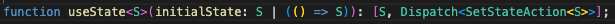

> <strong>- 주의 -</strong> <br /> 정리하면서 저의 생각도 많이 넣는 편입니다. <br /> 혹시나 제 글을 읽으실 때 아리송한 부분이 생기신다면 해당하는 공식 문서를 꼭 참고하시길 바랍니다. <br /> 또한, 저에게 익숙한 내용들은 생략하고 정리합니다.

타이핑에 따라 input 태그의 값을 업데이트 시키거나, 이미지 캐러셀을 클릭하면 다른 이미지를 보여주는 등 상호작용에 따라 화면을 바꿔줘야 할 때가 있다. 일단 이를 위해서는 컴포넌트가 현재의 input 값, 현재의 이미지 값을 저장하고 있어야 한다. 특정한 메모리, 즉 React의 컴포넌트가 무언가를 기억할 때 이 무언가를 React에서는 state라고 칭한다.

## When a regular variable isn’t enough

다음과 같이 코드를 작성하면 index가 바뀌어도 우리가 예상한대로는 동작하지 않는다.

```jsx
import { sculptureList } from './data.js';

export default function Gallery() {
  let index = 0;

  function handleClick() {
    index = index + 1;
  }

  let sculpture = sculptureList[index];
  return (
    <>
      <button onClick={handleClick}>Next</button>
      <h2>
        <i>{sculpture.name} </i>
        by {sculpture.artist}
      </h2>
      <h3>
        ({index + 1} of {sculptureList.length})
      </h3>
      
      <p>{sculpture.description}</p>
    </>
  );
}
```

그저 지역 변수를 변화시키는 것 뿐이기 때문이다. 화면을 바꾸기 위해 지역 변수를 사용하면 무엇이 문제일까? React에서는 다음과 같은 문제가 생긴다.

- 렌더링 사이에 지역 변수는 유지되지 않는다. 즉 index를 0에서 1로 바꾸었더라도 지역 변수이면 다음 렌더링에서 1이 아니라 0으로 남아있다.
- 지역 변수를 바꾼다고 해서 렌더링을 트리거하지 않는다. React에서는 바뀐 지역 변수를 새로운 데이터로 인식하지 않기 때문에 렌더링이 트리거되지 않는다.

즉 다음 2가지가 필요하다.

- 렌더링 사이에 데이터가 유지되어야 한다. 즉 렌더링 되면 바뀐 데이터로 유지되어야 한다.
- 데이터가 바뀌면 렌더링이 트리거 되어야 한다.

이를 위해 React에서 사용할 수 있는 것은 `useState` 라는 Hook이다. 이 useState는 다음 2가지를 제공한다.

- 렌더링 사이에도 유지되는 state 변수
- state를 업데이트하고 컴포넌트 렌더링을 트리거할 수 있는 setter 함수

다음과 같이 사용하면 된다.

```jsx
// state 생성
const [index, setIndex] = useState(0);

// index 업데이트 하기
const handleClick = () => {
  setIndex(index + 1);
};
```

useState를 보면 앞에 use라는 prefix가 붙는 것을 볼 수 있다. 이렇게 앞에 use가 붙으면 React에서는 이를 Hook으로 인식한다. 이러한 Hook은 컴포넌트의 최상단에서 호출되어야 한다. 조건문 안에 들어가 최상단이 아닌 곳에서 불려지면 경고가 뜬다. [이와 관련하여 이전에 velog에 쓴 글](https://velog.io/@metamong/Closure-on-React-Hooks#closure-on-usestate-useeffect)이 있다. 어쨋든 우리는 컴포넌트에서 Hook을 마치 import문처럼 최상단에서 사용해야 한다. 그렇지 않으면 어떻게 되는지 요약하자면 useState, useEffect 등의 Hook들이 자신의 원래 공간을 못 찾아갈 수 있다. 컴포넌트에서 useState와 useEffect 등으로 선언한 값들은 컴포넌트의 어떤 배열에 저장된다. 이 Hook들은 매번 렌더링 시 배열에서 자신이 차지하고 있는 공간으로 찾아가기 위해 index를 가지고 있다. 매번 렌더링 시 조건문에 의해 어떤 Hook은 호출되고 어떤 Hook은 호출되지 않는다면 index가 꼬여서 제대로 찾아갈 수 없다. 나는 [이 영상](https://www.youtube.com/watch?v=KJP1E-Y-xyo)을 보고 이를 이해하게 되었다.

## How does React know which state to return?

방금 말한 내용과 어느 정도 일맥상통하는 내용이다. React 공식 문서에서 이걸 얘기해줄 줄은 몰랐다.

useState로 state를 선언할 때 우리가 따로 key와 같은 identifier를 넣어 주지 않는다. 그렇다면 재렌더링 시, 즉 함수가 재호출될 때 마다 어떻게 저장된 값을 가지고 올까? 따로 엄청난 마법이 있는 것이 아니라, 이해할 수 있는 조금은 단순한 개념을 사용한다는 것만 일단 알아두자.

하지만 그 단순한 개념을 적용시키기 위해서 알아두어야 할 것은 useState와 같은 Hook들은 컴포넌트 함수의 최상단에서 호출되어야 한다는 것이다. if문 안에서 호출되는 등 최상단이 아닌 곳에서 호출되면 안된다. 간혹 이러한 주의점을 놓칠 것 같다면 [eslint-plugin-react-hooks](https://www.npmjs.com/package/eslint-plugin-react-hooks)라는 플러그인을 사용하면 된다.

이제 내부적으로 어떻게 Hook들이 재호출되더라도 본인의 값을 유지한 채 사용할 수 있는지 알아보자. 각 컴포넌트는 Hook과 대응되는 배열을 가지고 있다. 그리고 Hook에 매칭되는 배열 안의 값을 매칭시키기 위한 포인터(앞으로 cursor라고 하겠다) 또한 가지고 있다. 이에 대해 나 또한 [동영상과 여러 아티클들을 참고해 글](https://velog.io/@metamong/Closure-on-React-Hooks#closure-on-usestate-useeffect)을 작성한 적이 있다. 영어로 적혀져 있지만 보다 자세한 글은 [이 글](https://medium.com/@ryardley/react-hooks-not-magic-just-arrays-cd4f1857236e)을 확인하면 좋을 것 같다.

읽기 귀찮을 수 있다. 감히 내가 요약해보겠다. 다음과 같은 코드가 있다고 가정하자.

```tsx
import { useEffect, useState } from 'react';

const Component = () => {
  const [number, setNumber] = useState(0);

  useEffect(() => {
    console.log('useEffect');
  }, []);

  return (
    <div>
      <div>Current Number: {number}</div>
      <button onClick={() => setNumber(number + 1)}></button>
    </div>
  );
};

export default Component;
```

지금 여기서 사용된 훅은 useState, useEffect 2개인 점을 인지하자. 그리고 useState는 1번 째, useEffect는 2번 째로 선언되었다. 그렇다면 대략 다음과 같이 Component는 Hook을 기억하기 위해 배열과 cursor를 가지게 된다.

```tsx
const componentHooks = [];
let cursor = 0;
```

그리고 useState와 useEffect는 대략 다음과 같은 모습을 띈다.

```tsx
const componentHooks = [];
let cursor = 0;

const useState = initState => {
  const storedValue = componentHooks[cursor];
  const currentCursor = cursor; // cursor는 다음 Hook들이 호출될 때마다 증가함으로, componentHooks에서 자신의 위치를 기억하려면 미리 저장해놔야 한다.

  const setState = nextState => {
    componentHooks[currentCursor] = nextState;
    updateDOM(); // React가 알아서 변경된 부분을 찾아 DOM을 변경하고 화면을 업데이트한다.
  };

  // 첫 번째 호출이 아니라면 이미 저장되어 있는 값을 반환하면 된다.
  if (storedValue) {
    cursor += 1;
    return [storedValue, setState];
  }

  // 첫 번째 호출이라면 초깃값을 할당한다.
  componentHooks[cursor] = initState;
  cursor += 1;
  return [initState, setState];
};

const useEffect = ...
```

useEffect까진 작성하지 않았다. 하지만 여기서 알아야 할 부분은 useState가 componentHooks에서 0번째 자리를 차지하고, useEffect는 1번째 자리를 차지한다는 것이다. 각자 호출되면 cursor를 +1해서 다음 Hook이 사용할 수 있도록 준비해준다. 이를 통해 저장된 값들을 가지고 올 수 있다. 이 cursor는 Component가 호출될 때 0으로 초기화시켜주니 무한히 증가할 것 같은 의문은 없애도 된다. 어쨋든 호출되는 순서에 맞게 componentHooks에 저장된다. 만약 조건문으로 어떤 것은 호출되고 어떤 것은 때때로 호출되지 않는다면 매칭되는 순서가 꼬여서 Hook들이 componentHooks로부터 제대로 된 자신의 값을 가지고 올 수 없을 것이다.

## State is isolated and private

state는 독립적이다. useState를 사용하는 컴포넌트를 똑같이 3번 렌더링해도 각자 다른 state를 가지게 된다.

```tsx
import { useState } from 'react';

const App = () => {
  return (
    <>
      <Component />
      <Component />
      <Component />
    </>
  );
};

const Component = () => {
  const [number, setNumber] = useState(0);

  return (
    <div>
      <button onClick={() => setNumber(number + 1)}>증가</button>
      <div>{number}</div>
    </div>
  );
};

export default App;
```

위와 같이 작성하고 첫 번째 컴포넌트의 버튼을 클릭하면 3개의 컴포넌트가 모두 증가하는 것이 아니라, 첫 번째 컴포넌트의 number만 증가한다.

## 새롭게 알게 된 점

- useState를 타고 들어가보면 다음과 같이 초깃값으로 콜백 함수를 받을 수 있는 것을 확인할 수 있다. 즉 콜백 함수가 실행되어 반환된 값을 초깃값으로 설정할 수도 있다.



```tsx
const [value, setValue] = useState(() => {
  return 1;
});
```

## 참고

[State: A Component's Memory](https://react.dev/learn/state-a-components-memory)
