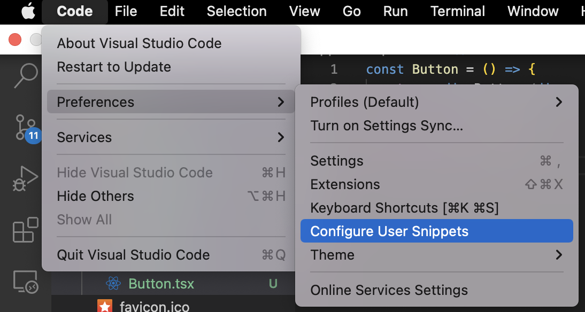
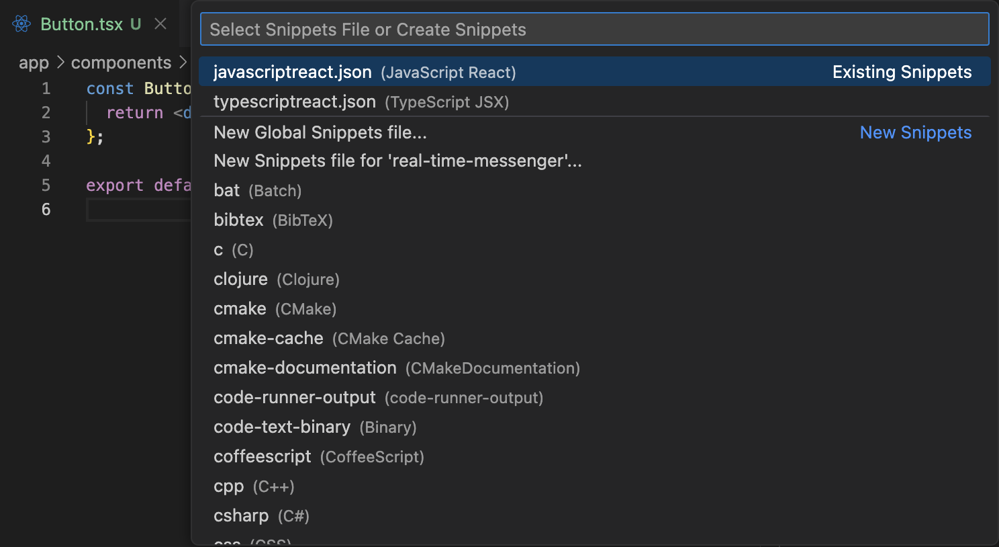

## 개요

React로 개발하다보면 컴포넌트를 많이 작성하는 데에 있어 피로감을 느끼곤 한다. 이를 덜어내기 위해 많은 사람들이 단축키만으로 Snippet을 빠르게 작성할 수 있는 [ES7+ React/Redux/React-Native](https://marketplace.visualstudio.com/items?itemName=dsznajder.es7-react-js-snippets)나 [Simple React Snippets](https://marketplace.visualstudio.com/items?itemName=burkeholland.simple-react-snippets)이라는 VSCode 익스텐션을 사용하고 있다.

하지만 나는 큰 피로감을 여태까지는 느끼지 않았기에 따로 익스텐션을 쓰지 않고 모두 타이핑해왔다. 근데 비로소 최근에 느끼기 시작했고 다른 사람들과 마찬가지로 VSCode 익스텐션을 사용해보았다. 그러나 아직은 React 컴포넌트에만 Snippet 필요성을 느꼈고, 익스텐션이 많아지는 것도 선호하지 않는 편이라 내가 직접 Snippet을 작성해보기로 했다.

## 방법

아주 간단하다. 먼저 다음과 같이 Configure User Snippets을 찾자.



찾고 나면 다음과 같은 화면이 뜬다. 여기서 `New Global Snippets file`을 선택하면 모든 파일에 적용할 수 있는 Snippet을, `New Snippets file for '프로젝트 이름'`을 선택하면 해당 프로젝트(폴더)에 적용할 수 있는 Snippet을 작성할 수 있다. 나는 TypeScript를 자주 사용하기에 tsx 파일에 적용할 수 있는 typescriptreact.json 파일을 선택했다.



그리고 나서 다음과 같이 작성해주었다. 간단히 설명하자면, prefix는 단축키를 의미한다. `rtafc`를 입력하고 엔터를 치면 body의 문자열들이 코드로 작성된다. 여기서 TM_FILENAME_BASE는 작성한 파일의 이름을 뜻한다. Button.tsx라면 Button이 저기에 입력되는 것이다.

```tsx
{
  "react typescript arrow function component": {
    "prefix": "rtafc",
    "body": [
      "const ${TM_FILENAME_BASE} = () => {",
      "  return <div>${TM_FILENAME_BASE}</div>;",
      "};",
      "",
      "export default ${TM_FILENAME_BASE};",
      ""
    ]
  }
}
```

이제 rtafc를 입력 후 tab이나 enter를 누르면 다음과 같이 곧바로 컴포넌트 Snippet을 작성할 수 있다.
```tsx
const Button = () => {
  return <div>Button</div>;
};

export default Button;
```

더 자세한 문법이나 방법들은 밑의 링크를 참고하면 될 것 같다.

## 참고

[Snippets in Visual Studio Code](https://code.visualstudio.com/docs/editor/userdefinedsnippets)
