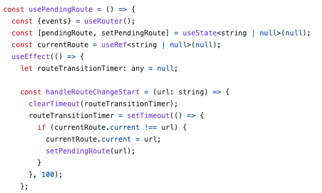

> <strong>- 주의 -</strong> <br /> 정리하면서 저의 생각도 많이 넣는 편입니다. <br /> 혹시나 제 글을 읽으실 때 아리송한 부분이 생기신다면 해당하는 공식 문서를 꼭 참고하시길 바랍니다. <br /> 또한, 저에게 익숙한 내용들은 생략하고 정리합니다.

컴포넌트는 React의 핵심 컨셉 중 하나이다. 컴포넌트는 UI를 구축하는 기초이다.

## Components: UI building blocks, UI를 구성하는 컴포넌트들

React는 HTML 마크업과 CSS, JavaScript 코드를 재사용 가능한 컴포넌트로 합쳐준다. 이 컴포넌트를 이용해 그냥 HTML 태그들로 마크업을 구성하듯이 순서를 바꿀 수도 있고 안에 중첩되는(ul - li, div 안의 div 등등) 화면을 구성할 수도 있다. 다음과 같이 말이다.(컴포넌트들로 구성된 React 공식 문서 페이지)

```tsx
<PageLayout>
  <NavigationHeader>
    <SearchBar />
    <Link to='/docs'>Docs</Link>
  </NavigationHeader>
  <Sidebar />
  <PageContent>
    <TableOfContents />
    <DocumentationText />
  </PageContent>
</PageLayout>
```

프로젝트가 커져 갈수록 화면의 많은 것들이 다른 곳에서도 재사용 가능한 컴포넌트들로 구성된다는 것을 느끼게 될 것이다. 이러한 재사용 가능한 컴포넌트들로 개발 속도도 높일 수 있다.

## Defining a component, 컴포넌트 정의하기

이전부터 전통적으로 웹 페이지를 만들 때 개발자들은 마크업 후 자바스크립트를 통해 상호작용을 더해줬다. 지금까지 잘 작동하고 있고, 앞으로도 많은 웹과 앱에 사용될 것으로 예상된다. React에서는 컴포넌트를 통해 마크업에 자바스크립트 함수, 로직을 더해줄 수 있다.

어떻게 컴포넌트를 구성할 수 있을까? 공식 문서에서는 현재 단계에서 일단 마크업까지만 설명해주고 있다.

### 1. Export component

export default를 통해 컴포넌트를 모듈 밖으로 내보낼 수 있도록 해라.

### 2. Define the function

JavaScript 함수로 컴포넌트를 선언해라. **이 때 주의할 점은 꼭 함수 이름 시작이 대문자여야 한다는 것이다.**

### 3. Add markup

컴포넌트 안에서 return문에 JSX문으로 마크업을 작성해라.

## 새롭게 알게 된 점

- 챌린지가 아직까지는 단순하면서 재밌다. 공식 문서에서 이렇게 작은 문제가 있는 건 처음 보는 것 같은데 마지막에 읽은 걸 복습하기에 아주 적절하지 않나 싶다.
- 아주 간단하게 React팀에서 어떻게 페이지의 마크업을 컴포넌트로 작성하는지 볼 수 있었다. React 공식 문서 깃헙 레포를 참고하면 어떻게 작성하면 될 지 많은 걸 참고할 수 있겠다는 생각이 들었다.
  - React 공식 문서의 소스 코드에서 hooks 폴더의 usePendingRoute라는 훅에서 any 타입이 쓴 걸 볼 수 있었다. routeTransitionTimer에 any가 쓰였다. setTimeout의 반환값인 timer id는 number나 NodeJS.Timeout을 사용하면 되는 것으로 알고 있는데 왜 any로 해둔 걸까?
  - fork해서 type을 고친 후 PR 날려볼 예정이다.
    - 여러 PR 참고하려고 보던 와중 [김정환님이 올리신 PR](https://github.com/reactjs/react.dev/pull/5965)도 확인할 수 있었다.
  - 소스 코드 보면서 알게 된 사실인데 React 공식 문서는 NextJS 프레임워크를 통해 만들어졌고 tailwind를 통해 스타일링 했으며 vercel을 통해 배포되어있다.



## 참고

[Your First Component](https://react.dev/learn/your-first-component)
